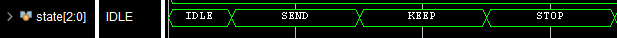
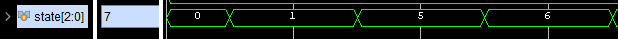

# Лабораторная работа 1 "SystemVerilog: типы данных"

Прежде чем начать изучать способы верификации с использованием инструментов языка SystemVerilog, необходимо изучить существующие и появившиеся типы данных.

## Цель

---

## Ход работы

- [Лабораторная работа 1 "SystemVerilog: типы данных"](#лабораторная-работа-1-systemverilog-типы-данных)
  - [Цель](#цель)
  - [Ход работы](#ход-работы)
  - [Теория](#теория)
    - [Типы стандарта Verilog](#типы-стандарта-verilog)
      - [Класс данных "Цепь"](#класс-данных-цепь)
      - [Класс данных "Переменная"](#класс-данных-переменная)
      - [Вектор](#вектор)
      - [Массив (Array)](#массив-array)
      - [Целочисленные константы](#целочисленные-константы)
      - [Присваивания между различными типами](#присваивания-между-различными-типами)
      - [Проверь себя](#проверь-себя)
    - [Скалярные типы](#скалярные-типы)
    - [Вспомогательные типы](#вспомогательные-типы)
      - [Собственные типы (typedef)](#собственные-типы-typedef)
      - [Перечисления (enum)](#перечисления-enum)
      - [События (events)](#события-events)
      - [Пустой тип (void)](#пустой-тип-void)
    - [Контейнеры](#контейнеры)
      - [Структуры (structures)](#структуры-structures)
      - [Многомерные векторы и массивы векторов (packed array / unpacked array)](#многомерные-векторы-и-массивы-векторов-packed-array--unpacked-array)
      - [Динамические массивы (dynamic array)](#динамические-массивы-dynamic-array)
      - [Ассоциативные массивы](#ассоциативные-массивы)
      - [Очереди (queue)](#очереди-queue)
    - [Интерфейсы (interfaces)](#интерфейсы-interfaces)
    - [Пакеты (packages)](#пакеты-packages)
      - [Почтовый ящик (mailbox)](#почтовый-ящик-mailbox)
    - [Преобразование типов (static\_cast, implicit cast)](#преобразование-типов-static_cast-implicit-cast)
  - [Практика](#практика)
  - [Задание](#задание)
  - [Порядок выполнения задания](#порядок-выполнения-задания)
  - [Список ссылок](#список-ссылок)

---

(выходит за пределы темы)
* Циклы (For, foreach, forever, repeat);
Области видимости ($unit).


---

## Теория

### Типы стандарта Verilog

Прежде чем говорить о типах сигналов, введенных в стандарте SystemVerilog (IEEE 1800-2017), рассмотрим типы, добавленные в стандарте Verilog(IEEE 1364-2005). Все эти типы можно использовать и в стандарте SystemVerilog.

В Verilog, каждому сигналу, константе, переменной или функции должен быть присвоен _тип данных_. Какие-то типы являются синтезируемыми, а какие-то используются только для моделирования абстрактного поведения.

Verilog поддерживает четыре базовых состояния, которые может принять сигнал: 0, 1, X и Z. Ниже представлено описание каждого из этих состояний:

|Значение|Описание|
|--------|--------|
|0| Логический ноль / ЛОЖЬ|
|1| Логическая единица / ИСТИНА|
|X| Неопределенное (неизвестное) или непроинициализированное состояние|
|Z| [Высокоимпедансное состояние](https://ru.wikipedia.org/wiki/%D0%92%D1%8B%D1%81%D0%BE%D0%BA%D0%BE%D0%B8%D0%BC%D0%BF%D0%B5%D0%B4%D0%B0%D0%BD%D1%81%D0%BD%D0%BE%D0%B5_%D1%81%D0%BE%D1%81%D1%82%D0%BE%D1%8F%D0%BD%D0%B8%D0%B5)|

<!-- В Verilog к этим значениям привязывается так называемая _сила сигнала_. Силы используются для определения значения сигнала, управляемого несколькими источниками. Сигнал принимает значение источника с большей силой сигнала. Если у источников силы сигнала равны, значение сигнала не определено в случае, если источники подают разные сигналы, и равно сигналу источников, если они подают одно и тоже значение.  
В университетских курсах по Verilog вы не будете использовать силы сигнала, о них написано выше лишь для полноты картины.   -->

---

#### Класс данных "Цепь"

В данном случае под словом "класс" подразумевается не термин ООП, а термин, определяющий коллекцию типов (т.е. в контексте `Класс <- Тип <- Вид <- Род`)

Как говорилось выше, каждому сигналу в Verilog должен быть назначен тип данных. Класс типов данных под названием "цепь" моделирует соединение (электрическую цепь) между компонентами и может принимать значения 0, 1, X, Z. Сигнал цепи постоянно управляется источником сигнала и меняет своё значение каждый раз, когда меняется значение на источнике (цепь не может хранить значение).


Рассмотрим рисунок выше. Красным цветом выделены сигналы класса "цепь". Сигнал _net\_11_ используется для соединения выхода логического элемента И со входом данных D-триггера _data\_0_. Выход логического элемента И является источником сигнала для цепи _net\_11_. Выход _data\_0_ является источником сигнала _net\_2_.

В Verilog множество типов класса цепь, но самым распространенным является тип **wire**(провод). Вы можете представить подобный сигнал, как провод, подключенный к некому источнику. Значение сигнала в любой части провода одинаково и совпадает со значением подключенного к нему источника сигнала. Если провод не подключен ни к одному источнику, он находится в высокоимпедансном состоянии (принимает значение Z).

Есть еще один тип, полностью идентичный типу **wire**, который называется **tri**. Эти типы взаимозаменяемы и разделены только для повышения читаемости кода. Тип **tri** используется, когда сигналом управляют несколько источников.


Пример сигнала, управляемого несколькими источниками.

---

#### Класс данных "Переменная"

Verilog также поддерживает типы данных, которые моделируют ячейки памяти. Сигналы класса "переменная" могут принимать значения 0, 1, X, Z<!-- , но с ними не связана сила сигнала -->. Типы класса "переменная" могут хранить присвоенное им значение до очередного присваивания. Ниже представлено описание переменных типов:

|Тип         |Описание|
|------------|--------|
|**reg**     | Переменная, моделирующая базовую ячейку памяти. Может принимать значения 0, 1, X, Z|
|**integer** | 32-битная переменная, представленная в [дополнительном коде](<https://ru.wikipedia.org/wiki/%D0%94%D0%BE%D0%BF%D0%BE%D0%BB%D0%BD%D0%B8%D1%82%D0%B5%D0%BB%D1%8C%D0%BD%D1%8B%D0%B9_%D0%BA%D0%BE%D0%B4>), представляющая диапазон чисел [‑2 147 483 648 : 2 147 483 647]|
|**real**    | 64-битная переменная, представляющая числа с плавающей точкой в диапазоне [2.2×10<sup>‑308</sup> : 2.2×10<sup>308</sup>]|
|**time**    | Беззнаковая 64-битная переменная, принимающая значения в диапазоне [0 : 9.2×10<sup>18</sup>] |
|**realtime**| Синоним типа **real**. Используется для повышения читаемости|

---

#### Вектор

В Verilog вектором называют одномерный массив элементов. Все типы класса "цепь", а также тип **reg** могут использоваться для формирования вектора. Синтаксис объявления вектора представлен ниже:

<pre>
<тип> [<старший индекс>:<младший индекс>] <i>имя_вектора</i>
</pre>

Несмотря на то, что может использоваться любой диапазон индексов (даже отрицательный), на практике стараются начинать младший индекс с нуля.  
Пример:

<pre>
<b>wire</b> [7:0] <i>sum</i>; // Объявляется 8-битный вектор с именем sum типа wire.
                // Старший индекс равен 7, младший — 0.
                // Векторы типа wire обычно называют "шиной"(bus).

<b>reg</b> [15:0] <i>Q</i>;   // В данной строке объявлен 16-битный вектор типа reg.
</pre>

Используя индекс, можно обратиться к отдельным битам вектора. С помощью диапазона индексов, можно получить доступ к диапазону соответствующих битов.  

|фрагмент кода|описание|
|-------------|--------|
|sum[0];      | Обращение к младшему биту вектора sum, объявленного выше|
|Q[15:8];     | Обращение к старшим восьми битам 16-битного вектора Q, объявленного выше|

</pre>

Обратите внимание, что нельзя объявить вектор типа **integer**, **time**, **real**, **realtime**. Однако, типы **integer** и **time** являются векторами сами по себе. Иными словами, вы не можете объявить следующий вектор:

<pre>
<b>integer</b> [7:0] dunno_what_size_of_this_object;
</pre>

но можете обращаться к отдельным битам объявленного объекта как если бы он был вектором:

|фрагмент кода|описание|
|-------------|--------|
|<b>integer</b> int_object;<br>int_object[31];|<br>Обращение к старшему биту вектора|

Таким образом, вы можете считать **integer** синонимом `reg signed [31:0]` (о значении **signed** будет чуть позже), а **time** синонимом `reg [63:0]`

Поскольку **real** и **realtime** представляют числа с плавающей точкой, они не считаются векторами, и вы не можете обратиться к их отдельным битам.

---

#### Массив (Array)

Массив (array) — это многомерное множество элементов. Массив можно назвать вектором векторов. Векторы внутри массива (элементы массива) обладают одинаковой размерностью. Для объявления массива, необходимо указать тип и размерность элементов массива, а также имя и размерность самого массива. При указании размерности массива, обычно сперва указывают начальный индекс, а после конечный.  
Синтаксис объявления массива:

<pre>
<тип элемента> [<старший индекс элемента> : <младший индекс элемента>] <i>
имя_массива</i> [начальный индекс массива : конечный индекс массива]
</pre>

Пример:  

<pre>
<b>reg</b> [7:0] <i>mem</i> [0:4095]; // Объявляется массив 8-битных векторов типа
                        // reg, размером 4096.
                        // Массив, элементами которого являются вектора
                        // типа reg (например то, что объявлено здесь)
                        // называют памятью.
                        // Элементы памяти называют "словами".

<b>integer</b> <i>A</i> [1:100];      // Объявляется массив со 100 элементами типа
                        // integer.
</pre>

К элементу массива можно обратиться, используя его индекс. Кроме того, если элементом массива является вектор, можно так же обратиться к отдельному биту этого вектора, добавив и его индекс.  
Примеры:

|фрагмент кода|описание|
|-------------|--------|
|mem[2];      | Обращение к третьему элементу массива mem (третьему, поскольку нумерация начинается с нуля).<br> Подобное обращение вернет 8-битный вектор типа reg.|
|mem[2][7];   | Обращение к старшему биту третьего элемента массива mem.|
|A[2];        | Обращение ко второму элементу массива A (в этом случае, нумерация начинается с единицы, поскольку так было указано при объявлении массива A)|

---

#### Целочисленные константы

В Verilog есть два способа выразить целое число. Первый способ — это обычная запись десятичного числа, формируемая последовательностью цифр от 0 до 9, с опциональным указанием знака перед ней. Второй способ — это запись целого числа с указанием основания системы исчисления. Данная форма записи состоит из трех частей:

1. опциональной константы размера
2. апострофа (`'`), за которым указывается формат основания системы исчисления
3. набора цифр, представляющих значение числа

<pre>
<размер>'[s]<основание><значение>
</pre>

Между каждой из частей может стоять пробел, но не внутри любой из них.

Первая часть (константа размера) указывает точное число бит целочисленной константы. Для указания размера используется ненулевое положительное десятичное число. Например, для указания двух шестнадцатиричных цифр потребуется 8 бит, поскольку каждая шестнадцатиричная цифра занимает 4 бита.  
Вторая часть, формат основания системы исчисления состоит из апострофа и нечувствительной к регистру букве, обозначающей основание системы исчисления, перед которой допустимо указать символ s(или S) для указания того, что число знаковое.

|Синтаксис|Описание                       |
|---------|-------------------------------|
|**'b**   | Беззнаковое двоичное          |
|**'o**   | Беззнаковое восьмеричное      |
|**'d**   | Беззнаковое десятичное        |
|**'h**   | Беззнаковое шестнадцатиричное |
|**'sb**  | Знаковое двоичное             |
|**'so**  | Знаковое восьмеричное         |
|**'sd**  | Знаковое десятичное           |
|**'sh**  | Знаковое шестнадцатиричное    |

Третья часть содержит беззнаковое число, записанное цифрами, разрешенными для данной системы исчисления. Шестнадцатиричные цифры a-f не чувствительны к регистру. Кроме того, в качестве цифры могут использоваться символы `x`, `z` и `?`(аналогичен `z`) для обозначения неопределенного/высокоимпендансного состояния соответствующих им бит.  
Если размер беззнакового числа в третьей части меньше размера, указанного в первой части, это число дополняется слева нулями за исключением случаев, когда в старшем бите числа записано `x` или `z`, в этом случае, число дополняется слева `x` или `z` соответственно.  
Если размер беззнакового числа в третьей части больше размера, указанного в первой части, это число обрезается слева.

Константы, для которых не указан размер будут иметь размер минимум 32 бита. Отрицательные числа представляются в дополнительном коде.  

При записи числа в любом его месте кроме начала может использоваться символ нижнего подчеркивания (`_`). Этот символ будет игнорироваться и используется как разделитель для повышения читаемости.

Пример 1 — Беззнаковые константы:

|фрагмент кода|описание|
|-------------|--------|
|659          | знаковое десятичное число|
|'h 837FF     | беззнаковое шестнадцатиричное число|
|'o7460       | беззнаковое восьмеричное число|
|4af          | запрещенная запись (шестнадцатиричная запись возможна лишь с 'h)|
<br>
Пример 2 — Знаковые константы:

|фрагмент кода|описание|
|-------------|--------|
|4'b1001      | 4-битное двоичное беззнаковое число|
|5 'D 3       | 5-битное десятичное беззнаковое число|
|3'b01x       | 3-битное беззнаковое двоичное число, у которого неизвестен младший бит|
|12'hx        | 12-битное неизвестное число|
|16'hz        | 16-битное высокоимпеднансное число|
<br>
Пример 3 — Использование знака с константами:

|фрагмент кода|описание|
|-------------|--------|
|8 'd -6      | Запрещено, константа в третьей части записывается в виде беззнакового числа|
|-8 'd 6      | Здесь записано -6 в дополнительном коде (1111_1010), хранящееся в 8-ми битах.|
|4 'shf       | Здесь записано 4-битное число с двоичной записью: '1111', которое интерпретируется как '-1' в десятичной записи. <br> Это эквивалент записи -4'h 1|
|-4 'sd15     | Это эквивалент записи -(-4'd 1), или двоичного '0001'|
|16'sd?       | То же, что и 16'hz|
<br>
Пример 4 — Выравнивание размера:

|фрагмент кода|описание|
|-------------|--------|
|8 'h F0AA    |Константа превышает указанный размер и будет обрезана до AA|
|8'sb1001     |Константа меньше указанного размера и дополняется слева нулями до "00001001"|
|13'h1z1      |Константа меньше указанного размера и дополняется слева Z до "zzzzzzzzz0001"|
<br>
Пример 5 — Использование нижнего подчеркивания:

|фрагмент кода          |
|-----------------------|
|27_195_000             |
|16'b0011_0101_0001_1111|
|32 'h 12ab_f001        |

---

#### Присваивания между различными типами

Verilog является так называемым языком со слабой типизацией, что означает, что он допускает присваивания между различными типами. Причиной тому является то, что Verilog относится к любому типу как к группе битов. Присваивая значения одного типа другому, Verilog автоматически обрезает или дополняет необходимым для присваивания количеством старших бит. Ниже приведен пример того, как Verilog справляется с присваиваниями между различными типами (предположим, что мы создали переменную `ABC_TB`, которая объявлена как `reg [2:0]`)

<pre>
ABC_TB = 2'b00; // ABC_TB будет присвоено 3'b000. Автоматически добавлен
                // старший бит
ABC_TB = 5;     // ABC_TB будет присвоено 3'b101. Целочисленное число
                // размером минимум 32 бита обрезано до 3-х.
ABC_TB = 8;     // ABC_TB будет присвоено 3'b000. Целочисленное число
                // со значащими битами "1000" будет обрезано до 3-х.
</pre>

---

#### Проверь себя

Чаще всего используемыми типами в Verilog являются wire и reg. В чем их фундаментальное различие?

1. У них нет различий, поскольку они оба могут принимать значения 0, 1, X, Z.
2. wire является типом класса "цепь" — это значит, что значением этого сигнала постоянно управляет источник. reg является типом класса "переменная" — это значит, что он будет хранить своё значение после присваивания.
3. wire может принимать лишь значения 0 и 1, в то время как reg может принимать значения 0, 1, X, Z.
4. Они не могут подаваться на входы друг друга.

---

### Скалярные типы

В [предыдущем разделе](#типы-стандарта-verilog) вы уже познакомились с некоторыми скалярными типами: это типы `wire` (`tri`) и `reg`. Эти типы объединяет то, что каждый из них может хранить один бит информации (при этом на бит информации в этом типе приходится четыре логических значения: `0`, `1`, `X`, `Z`).

В стандарте SystemVerilog появилось еще два скалярных типа: `bit` и `logic`. Тип logic является синонимом типа `reg` и введен для разрешения ситуаций, когда использование типа `reg` вводит в заблуждение. К примеру, при создании комбинационной логики через блок always_comb, требующего использования объектов [класса "Переменная"](#класс-данных-переменная), но не создающего реального регистра<sup>[1]</sup>.

```Verilog
wire mux_in0, mux_in1, mux_sel;
reg mux_out;                    // может быть воспринято как создание регистра
always @(*) begin
  case(mux_sel)
    1'b0: mux_out = mux_in0;
    1'b1: mux_out = mux_in1;
  endcase
end
```

```SystemVerilog
wire mux_in0, mux_in1, mux_sel;
logic mux_out;                  // поскольку слово 'logic' не ассоциируется
always_comb begin               // с созданием регистра, данная запись
  case(mux_sel)                 // не вводит в заблуждение
    1'b0: mux_out = mux_in0;
    1'b1: mux_out = mux_in1;
  endcase
end
```

Как было сказано ранее типы `wire` (`tri`) и `reg` (`logic`) могут хранить 4 значения. В некоторых ситуациях, такое поведение избыточно.
Для ситуаций, когда сигнал может принимать только два логических значения: `0` и `1` был добавлен соответствующий тип класса "Переменная" `bit`.

### Вспомогательные типы

#### Собственные типы (typedef)

Множество типов, представленных стандартом SystemVerilog может быть расширено типами, определёнными пользователем с помощью ключевого слова `typedef`.  
К примеру, таким образом можно дать алиас для существующих типов:

```SystemVerilog
typedef int intP;             // Объявление нового типа intP, который является типом int
typedef logic [7:0] strb_bus; // ОБъявление нового типа strb_bus, который создает
                              // объекты типа logic [7:0]
```

---

#### Перечисления (enum)

Перечисления позволяют объявить объединенный набор именованных констант. В дальнейшем, объявленные имена можно использовать вместо перечисленных значений, соответствующих этим именам. Если не указано иного, первому имени присваивается значение 0, каждое последующее увеличивается на 1 относительно предыдущего значения.

```SystemVerilog
    // IDLE = 0, SEND = 1, KEEP = 5, STOP = 6, RECEIVE = 7
    enum logic [2:0] {IDLE, SEND, KEEP=3'd5, STOP, RECEIVE} state;
    initial state = IDLE;
    always @(posedge clk) begin
        case(state)
            IDLE:    state <= SEND;
            SEND:    state <= KEEP;
            KEEP:    state <= STOP;
            STOP:    state <= RECEIVE;
            RECEIVE: state <= IDLE;
        endcase
    end
```

Кроме того, при должной поддержке со стороны инструментов симуляции, значения объектов перечислений могут выводиться на временную диаграмму в виде перечисленных имен:




---

#### События (events)

Событийные объекты позволяют выполнять взаимодействие/синхронизацию между активными процессами.  
События могут **произойти** (triggered event) и событий можно **ждать** (wait for event).

```SystemVerilog
module events_ex;
  event ev_1; //Объявление события

  initial begin
    // В данном блоке initial происходит срабатывание события
    $display($time,"\tTriggering The Event");
    ->ev_1;

  initial begin
    // Данный блок initial ждет срабатывания события
    $display($time,"\tWaiting for the Event to trigger");
    wait(ev_1.triggered);
    $display($time,"\tEvent triggered");
  end
endmodule


```

---

#### Пустой тип (void)

Тип `void` схож с типом `void` в языке Си. Это тип отсутствующих данных. Может применять в качестве типа возвращаемого функцией значения (когда функция не возвращает ничего). Может применяться при преобразовании типов, когда результат вызываемой функции, возвращающей какое-то значение не используется ни в каком выражении.

```SystemVerilog

function time get_cur_time();
  $display("%t", $time);
  return $time();
endfunction

initial begin
  time t1;
  t1 = get_cur_time();  // Нет проблем, возвращаемое значение
                        // присваивается переменной
  get_cur_time();       // Будет выдано предупреждение о том,
                        // что возвращаемое значение не используется
  'void(get_cur_time());// Нет проблем, поскольку возвращаемое значение
                        // приведено к типу void (нет данных)
end

```

---

### Контейнеры

Данный раздел содержит типы, являющиеся контейнерами для других типов. К ним относятся:

- Структуры
- Перечисления
- Массивы
  - Упакованные массивы
  - Распакованные массивы
  - Динамические массивы
  - Ассоциативные массивы
- Очереди

---

#### Структуры (structures)

Структура обозначает коллекцию типов, которая может быть использована как единый объект, сохраняя при этом возможность обратиться к отдельным её элементам. Данный тип (структура) подобен структурам в языке Си.

Примеры создания структур<sup>[2]</sup>:

```SystemVerilog
struct {
  bit [7:0] opcode;
  bit [23:0] addr;
} IR;               // анонимная структура,
                    // определяющая переменную IR

IR.opcode = 1;      // установка значения поля opcode переменной IR

typedef struct {    // объявление именованной структуры
bit [7:0] opcode;
bit [23:0] addr;
} instruction;      // (нового типа с названием instruction)
instruction IR;     // объявление переменной IR типа instruction
```

---

#### Многомерные векторы и массивы векторов (packed array / unpacked array)

Векторы в стандарте SystemVerilog не отличаются от векторов стандарта Verilog за исключением одного: стандарт SystemVerilog допускает создание многомерных векторов.  
Что это такое и чем отличается от массивов?

Многомерный вектор (упакованный массив) определяет единый элемент, который разделен на поля. В упакованном векторе гарантируется непрерывность данных в памяти. В многомерном массиве непрерывность данных (расположение элементов в памяти) не гарантируется. Многомерный вектор (упакованный массив) может создаваться только из элементов "упакованного" типа. К таким элементам относятся скалярные элементы: `bit`, `reg`, `logic`, `wire`. Массив (с любым количеством размерностей) может создаваться из любых типов: классов, строк, упакованных векторов.

Для создания многомерного вектора необходимо указать размерность до имени вектора.  
Многомерный массив создается указанием размерности после имени массива. Кроме того, при создании массива можно указать его размер, а не размерность.  

Для иллюстрации рассмотрим пример:

```SystemVerilog
logic [2:0][3:0] packed_array = {4'b0110,4'b1111,4'b0101};
```

Данный код создает упакованный массив, состоящий из трех четырехбитных элементов, которые размещены в памяти следующим образом:

```ascii
  2    1    0
|0110|1111|0101|
```

Сделаем из него многомерный массив, т.е. массив, состоящий из нескольких таких многомерных векторов:

```SystemVerilog
logic [2:0][3:0] packed_array [0:1] = {{4'b0110,4'b1111,4'b0101},{4'b1001,4'b0000,4'b1010}};
```

Пример создания такого же массива, но с указанием размера вместо размерности:

```SystemVerilog
                            // ⌜ здесь мы указали количество элементов массива,
                            // | а не его размерность
logic [2:0][3:0] packed_array [2] = {{4'b0110,4'b1111,4'b0101},{4'b1001,4'b0000,4'b1010}};
```

Оба примера создают распакованный массив состоящий из двух многомерных векторов (упакованных массивов), которые могут располагаться в памяти следующим образом:

```ascii
          2    1    0
|xxxxxxx|0110|1111|0101| 0
|xxxxxxx|1001|0000|1010| 1
```

Символами `x` обозначены участки памяти, не содержащие элементы массива. Таким образом, внутри отдельного упакованного массива, все элементы всё ещё располагаются в памяти непрерывно, однако между элементами распакованного массива могут быть пропуски (отсюда и названия этих массивов). Это связано с тем, что распакованный массив может состоять из элементов различного размера. К примеру, из двух строк, одна из которых содержит 5 символов, а другая — 10.

---

#### Динамические массивы (dynamic array)

---

#### Ассоциативные массивы

---

#### Очереди (queue)

---

### Интерфейсы (interfaces)

---

### Пакеты (packages)

---

#### Почтовый ящик (mailbox)

---


### Преобразование типов (static_cast, implicit cast)

---

## Практика

---

## Задание

---

## Порядок выполнения задания

---

## Список ссылок

1. [IEEE 1800-2017](https://ieeexplore.ieee.org/document/8299595), раздел 6.11.2 (стр.104)
2. [IEEE 1800-2017](https://ieeexplore.ieee.org/document/8299595), раздел 7.2 (стр.139)
