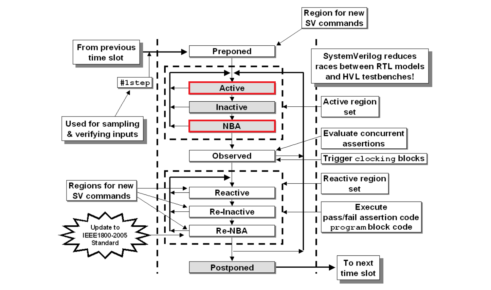
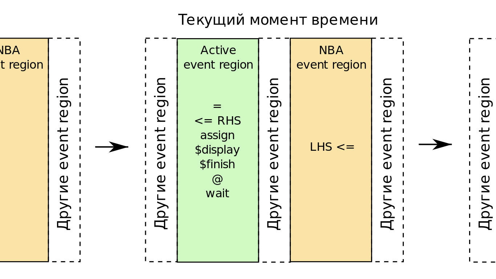

# Лабораторная работа 2 "SystemVerilog: Параллельные процессы, контроль времени и синхронизация. Задачи, функции."

## Цель

---

## Ход работы

---

## Основные обозначения

|Так выделяется важная информация, на которой стоит заострить внимание|
|:---|

_Так выделяется разбор примеров._

`Так выделяются определения, и ключевые слова SystemVerilog.`

## Теория

- [Лабораторная работа 2 "SystemVerilog: Параллельные процессы, контроль времени и синхронизация. Задачи, функции."](#лабораторная-работа-2-systemverilog-параллельные-процессы-контроль-времени-и-синхронизация-задачи-функции)
  - [Цель](#цель)
  - [Ход работы](#ход-работы)
  - [Основные обозначения](#основные-обозначения)
  - [Теория](#теория)
    - [1. Необходимые конструкции SystemVerilog](#1-необходимые-конструкции-systemverilog)
      - [1.1. `always_comb`](#11-always_comb)
      - [1.1. `always_ff`](#11-always_ff)
    - [2. SystemVerilog и параллельные процессы](#2-systemverilog-и-параллельные-процессы)
      - [2.1. SystemVerilog и параллельное исполнение](#21-systemverilog-и-параллельное-исполнение)
      - [2.2. SystemVerilog и время](#22-systemverilog-и-время)
      - [2.3. Определенность параллельного исполнения](#23-определенность-параллельного-исполнения)
      - [2.4.\* Области выполнения (event regions) SystemVerilog](#24-области-выполнения-event-regions-systemverilog)
        - [2.4.1.\* Active Event region](#241-active-event-region)
        - [2.4.2.\* NBA Event region](#242-nba-event-region)
        - [2.4.3.\* Кто первый: Active Event region или NBA Event region?](#243-кто-первый-active-event-region-или-nba-event-region)
      - [2.5. Последовательность выполнения событий SystemVerilog](#25-последовательность-выполнения-событий-systemverilog)
      - [2.6. Итоговые положения о параллельных процессах в SystemVerilog](#26-итоговые-положения-о-параллельных-процессах-в-systemverilog)
    - [3. Контроль времени в SystemVerilog](#3-контроль-времени-в-systemverilog)
      - [3.1. Указание единиц времени и точности для симуляции](#31-указание-единиц-времени-и-точности-для-симуляции)
        - [3.1.1. \``timescale`](#311-timescale)
        - [3.1.2. `timeunit` и `timeprecision`](#312-timeunit-и-timeprecision)
      - [3.2. Процедуры контроля времени](#32-процедуры-контроля-времени)
        - [3.2.1 Временная задержка `#`](#321-временная-задержка-)
        - [3.2.2 Ожидание события `@`](#322-ожидание-события-)
        - [3.2.3 Конструкция `wait`](#323-конструкция-wait)
        - [3.2.4\* Конструкция `wait_order`](#324-конструкция-wait_order)
    - [4. Синхронизация параллельных процессов](#4-синхронизация-параллельных-процессов)
      - [4.1.\* Семафоры](#41-семафоры)
      - [4.2. Почтовый ящик](#42-почтовый-ящик)
        - [4.2.1 Методы почтового ящика](#421-методы-почтового-ящика)
        - [4.2.2 Параметризуемый почтовый ящик](#422-параметризуемый-почтовый-ящик)
        - [4.2.3 Пример использования почтового ящика](#423-пример-использования-почтового-ящика)
      - [4.3. Именованные события](#43-именованные-события)
        - [4.3.1. Ожидание именованного события через `@`](#431-ожидание-именованного-события-через-)
        - [4.3.2. Ожидание именованного события через `wait`](#432-ожидание-именованного-события-через-wait)
        - [4.3.3. Заключение по ожиданию именованного события](#433-заключение-по-ожиданию-именованного-события)
    - [5. SystemVerilog последовательные и параллельные блоки](#5-systemverilog-последовательные-и-параллельные-блоки)
      - [5.1. Последовательные блоки](#51-последовательные-блоки)
      - [5.2. Параллельные блоки](#52-параллельные-блоки)
        - [5.2.1. `fork-join`](#521-fork-join)
        - [5.2.2. `fork-join_any`](#522-fork-join_any)
        - [5.2.3. `fork-join_none`](#523-fork-join_none)
        - [5.2.4. `disable fork`](#524-disable-fork)
      - [5.2.5. Безопасный `disable fork` или disable fork wrapper](#525-безопасный-disable-fork-или-disable-fork-wrapper)
    - [6. SystemVerilog задачи (`task`) и функции (`function`)](#6-systemverilog-задачи-task-и-функции-function)
      - [6.1. Отличие задач от функций](#61-отличие-задач-от-функций)
      - [6.2. Задачи (tasks)](#62-задачи-tasks)
        - [6.2.1. Направление аргументов задач](#621-направление-аргументов-задач)
        - [6.2.2. Базовые значения аргументов задач](#622-базовые-значения-аргументов-задач)
        - [6.2.3. Статические и автоматические задачи](#623-статические-и-автоматические-задачи)
      - [6.3. Функции](#63-функции)
      - [6.3.1. Направление аргументов функций](#631-направление-аргументов-функций)
        - [6.3.2. Возвращаемые функциями значения и void-функции](#632-возвращаемые-функциями-значения-и-void-функции)
        - [6.3.3. Возвращение массивов из функций](#633-возвращение-массивов-из-функций)
        - [6.3.4. Использование функций](#634-использование-функций)
        - [6.3.5. Базовые значения аргументов функций](#635-базовые-значения-аргументов-функций)
        - [6.3.6. Статические и автоматические функции](#636-статические-и-автоматические-функции)

### 1. Необходимые конструкции SystemVerilog

В процессе дальнейшего изучения данной лабораторной работы Вам понадобятся знания о нескольких новых конструкциях, введенных в SystemVerilog. Более подробно вы можете ознакомиться с ними в [SystemVerilog LRM](https://ieeexplore.ieee.org/stamp/stamp.jsp?tp=&arnumber=8299595&tag=1), в этом же разделе будут просто даны поясняющие комментарии.

#### 1.1. `always_comb`

Служит для реализации комбинационной логики и является аналогом `always @(*)`.

_Пример_

```verilog
// Simple OR here
always_comb begin
    c = a | b;
end
```

#### 1.1. `always_ff`

Служит для реализации последовательной логики, указывает на то, что реализуется триггер. В Verilog для проектирования последовательной логики использовался блок `always @(<фронт> <тактовый сигнал>)`, однако, при неправильном описании тела блока, код мог быть синтезирован в защелку. В блоке `always_ff` SystemVerilog были введены дополнительные ограничения, сводящие вероятность неверной имплементации практически к нулю.  

_Пример_

```verilog
// Flip-flop here
always_ff @(posedge clk) begin
    c <= a | b;
end
```

### 2. SystemVerilog и параллельные процессы
#### 2.1. SystemVerilog и параллельное исполнение

Несмотря на то, что в настоящее время SystemVerilog применяется не только для описания поведения цифровых устройств, все базовые конструкции были созданы “с оглядкой” именно на это, а остальные являются наследием базовых. Именно поэтому:

|Все процессы, выполняющиеся в конкретный момент времени симуляции, выполняются параллельно относитнльно времени симуляции, имитируя работу реальных цифровых устройств.|
|:---|

_В данном примере присваивания выполняются параллельно. Изменение сигнала l зависит от изменения сигнала p и, следовательно, сигнала q._

```verilog
assign p = q;
assign l = p;
```

|В SystemVerilog, `процессы` — это конструкции, которые выполняют определенную функцию. Процессы могут иметь состояние и могут реагировать на изменение входных данных.|
|:---|

Примерами процессов являются: `initial begin … end`, `always_comb begin … end`, `assign = …` с соответствующим кодом исполнения вместо `…`.

_В данном примере процесс постоянно обновляет сигнал p в соответствии с сигналом q:_

```verilog
assign p = q;
```

|Каждое изменение состояния переменной в системе, описанной при помощи процессов SystemVerilog, считается `событием обновления` или просто `событием`. Процессы чувствительны к событиям обновления.|
|:---|

Когда событие обновления выполняется, все процессы, которые чувствительные к этому событию, тоже выполняются, причем, в произвольном порядке. Стоит отметить, что исполнение одного процесса может являться событием обновления для других процессов.

_В данном примере положительный фронт сигнала clk служит событием для запуска кода, заключенного в begin-end, однако, событием обновления для сигнала c является изменение сигнала a или сигнала b._

```verilog
always_ff @(posedge clk) begin
    c <= a | b; // Posedge of 'clk' runs this code line
end
```

#### 2.2. SystemVerilog и время

Помимо событий, еще одним ключевым аспектом симулятора является время. 

|Термин `время моделирования` используется для обозначения времени, которое потребуется для работы описанной цифровой системы в реальности. Далее термин `время` будет использоваться взаимозаменяемо с `временем моделирования`.|
|:---|

#### 2.3. Определенность параллельного исполнения

Ранее было сказано, что, для конкретного момента времени, все процессы языка выполняются параллельно относительно времени симуляции. Кажется логичным, что порядок выполнения событий в таких процессах не определен. Однако, это далеко не так.

|Порядок выполнения событий различных типов друг относительно друга в SystemVerilog определен.|
|--|

К примеру, стандарт языка SystemVerilog однозначно требует от каждого симулятора, чтобы порядок выполнения блокирующих (`=`) и неблокирующих (`<=`) присваиваний, то есть событий, был строго определен друг относительно друга, так как это события различных типов. 

_В данном примере обновление значения переменной `a` произойдет позже обновления значения переменной `b`._

```verilog
// Two parallel processes here
initial begin
    a <= 5; // This will be second, because '=' wins '<='
end

initial begin
    b  = 3; // This will be first
end
```

_А вот для двух блокирующих присваиваний в конкретный момент времени порядок не определен, так как это события одного типа._

```verilog
// Two parallel processes here
// Who is first?
// Behaviour is undetermined!
initial begin
    a = 5;
end

initial begin
    b = 3;
end
```

Отметим, что в рамках одного процесса, порядок выполнения событий одного типа или вложенных процессов, содержащих события одного типа, определен.

_В примере ниже присвоение переменной `a` произойдет перед присвоением переменной `b` События присвоения происходят последовательно, так как заключены в теле процесса `initial begin ... end`._

```verilog
// One process here
initial begin
    a = 5; // This will be first
    b = 5; // This will be second, because inside one process
end
```

Но что же это за типы событий такие и как же определить очередность их выполнения? [В пункте 2.4](#24-области-выполнения-event-regions-systemverilog) будет подробно описан сам подход к планированию очередности событий и, исходя из этого подхода, будет определена очередность выполнения. Те, кто хотел бы сразу получить “сухую выжимку” без лишней теории, могут переходить к [пункту 2.5](#25-последовательность-выполнения-событий-systemverilog), чего я бы делать не советовал, потому что вся суть, еще и с примерами, раскрывается как раз в [пункте 2.4](#24-области-выполнения-event-regions-systemverilog).

#### 2.4.* Области выполнения (event regions) SystemVerilog

|Для взаимодействия процессов между собой, а также планирования очередности их выполнения в рамках одного момента времени, в SystemVerilog один временной интервал разделен на несколько `областей выполнения (event region)`, где для каждой области определен свой набор событий для выполнения.|
|:---|

Далее термин `регион выполнения` будет эквивалентен термину `область выполнения`.

Распределение процессов между областями выполнения – достаточно сложный механизм, поэтому, в рамках данного курса, он не будет описан досконально, а выделены лишь те особенности, которые потребуются для понимания дальнейшей теории. Для получения полной и исчерпывающей информации можно обратиться к разделу 4.4 [SystemVerilog LRM](https://ieeexplore.ieee.org/stamp/stamp.jsp?tp=&arnumber=8299595&tag=1) или же к статье [SystemVerilog Event Regions, Race Avoidance & Guidelines](../.docs/lab_02/CummingsSNUG2006Boston_SystemVerilog_Events.pdf).

На рисунке ниже представлена структурная схема обработки процессов для конкретного момента времени.

Стоит отметить, что, для простоты восприятия, из данной схемы убраны так называемые PLI-области, в которых происходит взаимодействие с внешним ПО, например, библиотекой, написанной на языке C.



Схема, даже без PLI-областей, достаточно сложна, однако, в рамках данного курса мы заострим внимание на двух регионах выполнения, которые на схеме выделены красным – `Active` и `NBA`.

Разберем каждый из этих двух регионов чуть подробнее.

##### 2.4.1.* Active Event region

В этом регионе происходит следующее:
-	выполняются все блокирующие присваивания (`=`);
-	вычисляются правые части (RHS) неблокирующих присваиваний (`<=`);
-	выполняются все непрерывные присваивания (`assign`);
-	обновляются все входы и выходы модулей;
-	выполняются команды `$display` и `$finish`;
-	выполняются конструкции `@` и `wait()`.

|Отметим, что в `Active Event region все события выполняются в случайном порядке`, и каждое событие может послужить триггером для запуска другого события. События выполняются до тех пор, пока не останется не выполненных для текущего момента времени.|
|:---|

_Приведем пример_

```verilog
module active_event_region;

    logic p, q;

    // 'assign' and 'initial' runs in parallel
    // |
    // V
    
    assign p = q;

    initial begin
        q = 1;
        #1 q = 0;
        $display(p); // Can be evaluated before 'assign p = q;'
        $stop();
    end

endmodule
```

_Результатом `$display(p)` для данного примера может быть либо 0, либо 1. Присвоение 0 переменной q включает событие обновления для переменной p. Симулятор может либо продолжить блок initial и выполнить команду `$display`, либо выполнить обновление для p, за которым последует `$display`._

##### 2.4.2.* NBA Event region

|`Основной функцией NBA Event region является обновление переменных левой стороны (LHS) неблокирующих присваиваний`. Обновление происходит только для тех присваиваний, правая часть которых изменилась в предшествующем Active Event region.|
|:---|

_Приведем пример. В данном примере есть 3 блока, которые выполняются параллельно: `initial`, `always_ff` и еще один `initial`._

_`Уделите особое внимание разбору данного примера.` Это сильно упростит процесс обучения в будущем._

```verilog
module active_nba_event_region;

    bit p, q, clk;

    // All 'begin-end' blocks below are executed in parallel
    // |
    // V

    // Generate clock
    initial begin
        clk <= 0;
        forever begin
            #10 clk <= ~clk;
        end
    end

    // 'p <= q' will be evaluated in NBA event region
    // after '@(posedge clk)' in previous Active event region
    always_ff @(posedge clk) begin
        p <= q;
    end

    initial begin
        q = 1;
        @(posedge clk); // Wait for clock
        $display(p);    // Here p = 0
        #1;             // Step to the next time event
        $display(p);    // Print updated value
        $stop();
    end

endmodule
```

_Результат:_

```
# Loading work.active_nba_event_region(fast)
# run -a
# 0
# 1
```

_Обратим внимание на последний `initial`. После фронта тактового сигнала выводим переменную `p`, значение которой будет 0, так как мы все еще находимся в Active Event region. Далее продвигаемся во времени и выводим `p` опять. Результатом вывода будет 1, так как запись в `p` произошла в NBA Event region в предыдущем моменте времени._

##### 2.4.3.* Кто первый: Active Event region или NBA Event region?

|Основным тезисом является: `все события Active Event region всегда выполняются раньше событий NBA Event region`|
|:---|


#### 2.5. Последовательность выполнения событий SystemVerilog

Суммируя информацию пункта 2.3, можно прийти к выводу, что для конкретного момента времени последовательность выполнения событий будет следующая:

1.	Следующие процессы, причем порядок выполнения для них не определен:
    - выполняются все блокирующие присваивания (`=`);
    - вычисляются правые части (RHS) неблокирующих присваиваний (`<=`);
    - выполняются все непрерывные присваивания (assign);
    - обновляются все входы и выходы модулей;
    - выполняются команды `$display` и `$finish`;
    - выполняются конструкции @ и wait().
2.	Обновляются левые части (LHS) неблокирующих присваиваний (`<=`).



Стоит отметить, что проверка `assertions`, обновление значений `clocking block` и еще некоторые события не были разобраны и занимают свое место выполнения в конкретном моменте времени. Это было сделано во избежание перегруженности материала, а также по причине практически полного отсутствия неопределенных ситуаций при их использовании.

#### 2.6. Итоговые положения о параллельных процессах в SystemVerilog

Основные тезисы:
  - все процессы SystemVerilog выполняются параллельно, имитируя работу реальных цифровых устройств;
  - каждое изменение состояния переменной в системе считается событием;
  - процессы чувствительны к событиям, то есть, когда событие выполняется, все процессы, которые чувствительные к этому событию, тоже выполняются;
  - для взаимодействия процессов между собой, а также планирования очередности их выполнения в рамках одного момента времени, в SystemVerilog один временной интервал разделен на несколько областей выполнения (event region);
  - области выполнения и алгоритм распределения событий по этим областям и определяет последовательность выполнения событий и зависящих от них процессов в системе.

|Последовательность выполнения событий и зависящих от них процессов в SystemVerilog определена в [пункте 2.5](#25-последовательность-выполнения-событий-systemverilog).|
|:---|


### 3. Контроль времени в SystemVerilog

#### 3.1. Указание единиц времени и точности для симуляции

|Для симуляции работы цифровой системы необходимы `единицы измерения времени`, а также `единицы точности`, с которой будет округляться время симуляции.|
|:---|

В языке SystemVerilog есть две возможности настройки временных единиц, а именно:
  - директива компилятора \``timescale`;
  - ключевые слова `timeunit` и `timeprecision`.

##### 3.1.1. \``timescale`

|Данная директива наследована от языка Verilog. \``timescale` указывает единицу времени и точность по умолчанию для всех элементов дизайна, которые перечислены в исходном коде после этой директивы и не имеют конструкций `timeunit` и `timeprecision`, указанных в элементе дизайна.|
|:---|

Директива \``timescale` остается в силе с момента ее появления в исходном коде до тех пор, пока не будет встречена другая директива \``timescale`, которая переопределит значения для последующих модулей, которые будут скомпилированы.

Синткасис: \``timescale единица времени / единица округления времени`

_Пример_

```verilog
`timescale 1ns / 10ps
module A (...);
    ...
endmodule

module B (...);
    ...
endmodule

`timescale 1ps/1ps
module C (...);
    ...
endmodule

```

_В данном примере, если последовательность компиляции будет `A`, `B`, `C`, то последовательность для модулей `A` и `B` на этапе компиляции будет определена единица времени в 1 нс и единица округления времени в 10 пс, а для модуля C единица времени в 1 пс и единица округления времени в 1 пс._

##### 3.1.2. `timeunit` и `timeprecision`

|Единицы времени и точности времени могут быть объявлены ключевыми словами `timeunit` и `timeprecision` соответственно. Точность времени также может быть объявлена с использованием необязательного второго аргумент для ключевого слова `timeunit` при помощи косой черты.|
|:---|

```verilog
module D (...);
    timeunit 100ps;
    timeprecision 10fs;
    ...
endmodule

module E (...);
    timeunit 100ps / 10fs; // timeunit with optional second argument
    ...
endmodule
```

Ключевые слова `timeunit` и `timeprecision` должны предшествовать любым другим элементам модуля, в котором они указаны. Также, объявление слов может повторяться в коде модуля позже, но значение временных единиц должны повторять значения из предыдущего объявления.

#### 3.2. Процедуры контроля времени

В языке SystemVerilog есть несколько возможностей контроля времени симуляции, а именно:
  - Временная задержка `#`;
  - Ожидание события `@`;
  - Конструкция `wait`.
  
Первые два способа наследованы от Verilog и для них будут приведены лишь примеры.

##### 3.2.1 Временная задержка `#`

_Пример_

```verilog
`timescale 1ns/100ps
module simple_delay;

    int a;

    initial begin
        a = 5;
        #5.07; // 5.1ns delay here, because time precision
               // is 100ps = 0.1ns -> 5.07 ~ 5.1
        a = 10;
    end

endmodule
```

##### 3.2.2 Ожидание события `@`

_Пример_

```verilog
module simple_event_wait;

    logic clk;

    initial begin
        clk <= 0;
        forever #5 clk <= ~clk;
    end

    initial begin
        @(posedge clk);
        $display("Got clk at time %0d", $realtime());
    end

endmodule

```

_Результат_

```
# Loading work.simple_event_wait(fast)
# run -a
# Got clk at time 5
```

##### 3.2.3 Конструкция `wait`

Выполнение кода может быть отложено до тех пор, пока определенное условие не станет истинным. Это достигается с помощью конструкции `wait`. 

|Конструкция `wait` оценивает условие, и, если оно не истинно, конструкции, следующие за `wait`, должны оставаться заблокированными до тех пор, пока это условие не станет истинным.|
|:---|

Конструкцию `wait` зачастую используют, когда нет уверенности, что событие, которого ожидают, не произошло до выполнения `wait`.

_Пример_

```verilog
module wait_vs_event;

    timeunit 1ns;

    bit a;

    initial begin
        #5; a = 1; // 'a' triggers at 5ns
        $display("Set 'a' at time %0d", $realtime());
    end

    initial begin
        #10;
        $display("@: Wait 'a' at time %0d", $realtime());
        @(a); // This will stuck forever, as 'a' was triggered earlier
        $display("@: Got 'a' at time %0d", $realtime());
    end

    initial begin
        #10;
        $display("wait: Wait 'a' at time %0d", $realtime());
        wait(a); // This will not stuck and will be evaluated immediately
        $display("wait: Got 'a' at time %0d", $realtime());
    end

endmodule
```

_Результат_

```
# Loading work.wait_vs_event(fast)
# run -a
# Set 'a' at time 5
# @: Wait 'a' at time 10
# wait: Wait 'a' at time 10
# wait: Got 'a' at time 10
```

_Так как ожидание события `@` реагирует только на изменение сигнала, то код после `@` не будет исполнен, так как ожидание запущено после изменения сигнала. Конструкция `wait` чувствительна к уровню сигнала, и код после `wait` будет исполнен, даже если сигнал изменился раньше во времени._


##### 3.2.4* Конструкция `wait_order`

Отдельного упоминания заслуживает конструкция `wait_order`. Принцип работы у нее такой же, как и у `wait`, однако при помощи нее можно ожидать выполнения сразу нескольких условий в определенном порядке.

_Пример_

```verilog
initial begin
    wait_order(a == 1, b == 2, c == 3);
    $display("wait: Got all at time %0d ", $realtime());
end
```

_В данном примере `$display` будет выполнена после выполнения всех условий, перечисленных в скобках wait_order слева направо._


### 4. Синхронизация параллельных процессов

Для синхронизации параллельных процессов в SystemVerilog используются:
  - семафоры (semaphores);
  - почтовый ящик (mailbox);
  - именованные события (event);

#### 4.1.* Семафоры

|`Семафор` — это по своей сути хранилище определенного размера. Является встроенным в SystemVerilog.|
|:---|

При создании семафора инициализируется хранилище, содержащее фиксированное количество ключей. Процессы, использующие семафоры, должны получить ключ, прежде чем они смогут продолжить выполнение. При этом все процессы, не получившие достаточного количества ключей, должны ждать, пока ключи не появятся в хранилище.

С семафором используются следующие методы:
  - `new()` – создание семафора;
  - `get()` – запрос одного или нескольких ключей; 
  - `put()` – возвращение одного или нескольких ключей в хранилище;
  - `try_get()` – попытка получить один или несколько ключей.

|Отличие `get()` от `try_get()` в том, что, если ключа в хранилище нет, метод `get()` будет ожидать, пока ключ не вернется, а `try_get()` не будет ожидать, а завершиться моментально, указав флагом на отсутствие ключа.|
|:---|

_Пример_

```verilog
module semaphore_example;

    timeunit 10ns;

    semaphore sem = new(1);

    // Process 0
    initial begin
        sem.get(1);
        $display("Process 0: Got key at time %0d", $realtime());
        #10;
        sem.put(1);
    end

    // Process 1
    initial begin
        #1;
        sem.get(1); // Will stuck here intil process key return at 10ns
        $display("Process 1: Got key at time %0d", $realtime());
        #10;
        sem.put(1);
    end

endmodule
```

_Результат_

```
# Loading work.semaphore_example(fast)
# run -a
# Process 0: Got key at time 0
# Process 1: Got key at time 10
```

_В данном примере процесс 0 заберет из семафора ключ и процесс 1 будет вынужден ждать 10 нс до того, как ключ вернется и он сможет его получить._

#### 4.2. Почтовый ящик

|`Почтовый ящик` — это механизм связи, позволяющий обмениваться сообщениями между процессами.|
|:---|

Данные могут отправляться в почтовый ящик одним процессом и извлекаться другим. Почтовые ящики создаются с ограниченным или неограниченным размером. Процесс, пытающийся поместить сообщение в переполненный почтовый ящик, должен быть приостановлен до тех пор, пока в почтовом ящике не освободится достаточно места. 

##### 4.2.1 Методы почтового ящика

С почтовым ящиком используются следующие методы:
  - `new()` – создание почтового ящика;
  - `put()` – помещение сообщения в почтовый ящик;
  - `try_put()` – попытка поместить сообщение в почтовый ящик;
  - `get()` или `peek()` – получить сообщение из почтового ящика;
  - `try_get()` или `try_peek()` – попытка получить сообщение из почтового ящика;
  - `num()` – получить количество сообщений в почтовом ящике.

Про отличия методов с постфиксом `try_` можно прочитать в [пункте 4.1](#41-семафоры). Принцип тот же – сразу выполняются, сигнализируя флагом о том, получено ли сообщение.

|Методы `peek` и `try_peek` получают сообщение, но не убирают его из почтового ящика, только лишь копируя сообщение.|
|:---|

##### 4.2.2 Параметризуемый почтовый ящик

По умолчанию почтовый ящик может пересылать данные любых типов, однако это может приводить к ошибкам в ходе симуляции при попытке получить сохранения данных в несоответствующий тип.

|SystemVerilog есть возможность `параметризации почтового ящика` определенным типом. Синтаксис аналогичен параметризации модуля.|
|:---|

_Пример параметризации почтового ящика строкой_

```verilog
mailbox#(string) box;  // Mailbox with string messages
```

##### 4.2.3 Пример использования почтового ящика

```verilog
module mailbox_example;

    timeunit 10ns;

    mailbox#(string) box = new();

    // Process 0
    initial begin
        static string message = "Hello!";
        #5; // Wait and put message
        box.put(message);
        $display("Process 0: Set message '%s' at time %0d", message, $realtime());
    end

    // Process 1
    initial begin
        string message;
        while(!box.try_get(message)) begin // Try to get message
            $display("Process 1: No message at time %0d", $realtime());
            #2;
        end
        $display("Process 1: Got message '%s' at time %0d", message, $realtime());
    end

endmodule
```

_Результат_

```
# Loading work.mailbox_example(fast)
# run -a
# Process 1: No message at time 0
# Process 1: No message at time 2
# Process 1: No message at time 4
# Process 0: Set message 'Hello!' at time 5
# Process 1: Got message 'Hello!' at time 6
```

_В данном примере процесс 1 циклически опрашивает почтовый ящик, пока не будет получено сообщение от процесса 0._

#### 4.3. Именованные события

|Переменная типа `event` называется именованным событием. Именованное событие представляет собой контейнер для объекта синхронизации. Процессы могут `запускать события` и `ожидать события`. Так, процесс, который ожидает события, не будет продолжен до его запуска иным процессом.|
|:---|

Процессы могут ожидать именованного события либо с помощью оператора `@`, либо с помощью конструкции `wait().`

Процессы могут запускать событие можно при помощи операторов `->` и  `->>`. Разобран будет лишь `->`, так как `->>` используется в очень редких и специфичных случаях, которые лежат за рамками этого курса.

##### 4.3.1. Ожидание именованного события через `@`

Основной механизм ожидания запуска именованного события — оператор `@`. Он блокирует ожидающий процесс до тех пор, пока не сработает ожидаемое событие.

Стоит отметить, что события `->` и `@` выполняются в Active Event region и их последовательность не определена (см. [пункт 2.3](#23-области-выполнения-event-regions-systemverilog) и [2.4](#24-последовательность-выполнения-событий-systemverilog)). То есть, если запуск и ожидания события будут запущены в один момент времени (time slot), то ожидание может запуститься после запуска и процесс не разблокируется. Для исключения данной проблемы используется подход, описанный в [пункте 4.3.2](#432-ожидание-именованного-события-через-wait).

_Пример:_

```verilog
module simple_event_example;

    timeunit 10ns;

    event e;

    // Process 0
    initial begin
        #1;
        $display("Process 0: Triggerring event at time %0d", $realtime());
        -> e;
    end

    // Process 1
    initial begin
        $display("Process 1: Waiting event at time %0d", $realtime());
        @(e);
        $display("Process 1: Got event at time %0d", $realtime());
    end

endmodule
```

_Результат_

```
# Loading work.simple_event_example(fast)
# run -a
# Process 1: Waiting event at time 0
# Process 0: Triggerring event at time 1
# Process 1: Got event at time 1
```

_В данном примере процесс 1 будет разблокирован, так как ожидание запущено раньше, чем активация самого события._

##### 4.3.2. Ожидание именованного события через `wait`

|Наиболее эффективным и не приводящим к гонкам является метод ожидания через `wait`.|
|:---|

У именованного события есть встроенная функция `triggered`, возвращающая истинное значение, если событие было запущено в текущем моменте времени. Если использовать конструкцию `wait` вместе с этой функцией, то для пользователя не будет играть никакой роли очередность ожидания события и запуска события.

_Пример_

```verilog
module wait_event_example;

    timeunit 10ns;

    event e;

    // Process 0
    initial begin
        $display("Process 0: Triggerring event at time %0d", $realtime());
        -> e;
    end

    // Process 1
    initial begin
        $display("Process 1: Waiting event at time %0d", $realtime());
        wait(e.triggered());
        $display("Process 1: Got event at time %0d", $realtime());
    end

endmodule
```

_Результат_

```
# Loading work.wait_event_example(fast)
# run -a
# Process 0: Triggerring event at time 0
# Process 1: Waiting event at time 0
# Process 1: Got event at time 0
```

_Не смотря на то, что ожидание и запуск триггера происходят в одном моменте времени симуляции (time slot), процесс 1 всегда сможет завершиться._


##### 4.3.3. Заключение по ожиданию именованного события

|Для ожидания именованного события всегда должна использоваться конструкция `wait(<имя_события>.triggered())`.|
|:---|

### 5. SystemVerilog последовательные и параллельные блоки

|`Блочные выражения` или `блоки` – средство группировки конструкций вместе таким образом, чтобы синтаксически они выполняли единую функцию.|
|:---|

Существует два типа блоков, а именно:
  - последовательные;
  - параллельные.

#### 5.1. Последовательные блоки

|`Последовательными блоками` являются блоки, заключенные в `begin-end`. Это уже известные `initial begin … end` и т.д. В них код выполняется последовательно.|
|:---|

```verilog
initial begin // This is sequential block
    <statement 1>
    <statement 2>
end
```

#### 5.2. Параллельные блоки

##### 5.2.1. `fork-join`

|`В параллельных блоках` перечисленные конструкции выполняются параллельно. Параллельный блок называется также `fork-join` блоком из-за синтаксиса.|
|:---|

_Пример параллельного блока_

```verilog
module fork_join_example_1;

    initial begin
        fork
            // All this lines are executing in parallel
            #50  $display("Process 0 finished at time %0d", $realtime());
            #100 $display("Process 1 finished at time %0d", $realtime());
            #150 $display("Process 2 finished at time %0d", $realtime());
            #200 $display("Process 3 finished at time %0d", $realtime());
        join
    end

endmodule
```

_Результат_

```
# Loading work.fork_join_example_1(fast)
# run -a
# Process 0 finished at time 50
# Process 1 finished at time 100
# Process 2 finished at time 150
# Process 3 finished at time 200
```

_Так как каждая строка запускается параллельно с другими, то на момент, когда пройдет 50 нс в первой строке, во второй строке тоже пройдет 50 нс, и `$display` выполнится еще 50 нс, тогда как в 3 строке уже пройдет 50 + 50 = 100 нс, и так далее._

Также, внутри `fork-join` код можно разбивать на блоки при помощи `begin-end`. Такой подход используется, когда необходимо в рамках одного параллельного процесса последовательно выполнить несколько других.

_Пример_

```verilog
module fork_join_example_1;

    initial begin
        fork
            begin
                // This two lines will execute consequentally
                #50  $display("Process 0 time %0d", $realtime());
                #120 $display("Process 0 time %0d", $realtime());
            end
            #150 $display("Process 1 finished at time %0d", $realtime());
            #200 $display("Process 2 finished at time %0d", $realtime());
        join
    end

endmodule
```

_Результат_

```
# Loading work.fork_join_example_1(fast)
# run -a
# Process 0 time 50
# Process 1 finished at time 150
# Process 0 time 170
# Process 2 finished at time 200
```

_В данном примере в блоке, обрамленном `begin-end`, два вызова `display` происходят последовательно. При этом сам блок `begin-end` выполняется параллельно с процессами 1 и 2._

|Параллельный блок `fork-join` завершится тогда, когда все параллельные процессы в нем будут завершены.|
|:---|

Однако существуют конструкции для изменения условия завершения блока.

##### 5.2.2. `fork-join_any`

|Параллельный блок `fork-join_any` завершится тогда, когда хотя бы один из параллельных процессов в нем завершится.|
|:---|

Стоит отметить, что все запущенные в нем процессы продолжат выполняться параллельно с кодом, который должен выполняться после параллельного блока.

_Пример_

```verilog
module fork_join_example_2;

    timeunit 1ns;

    initial begin
        fork
            #10 $display("Process 0 finished at time %0d", $realtime());
            #20 $display("Process 1 finished at time %0d", $realtime());
        join_any
        $display("Parallel block finished at time %0d", $realtime());
        #50;
        $stop();
    end

endmodule
```

_Результат_

```
# Loading work.fork_join_example_2(fast)
# run -a
# Process 0 finished at time 10
# Parallel block finished at time 10
# Process 1 finished at time 20
```

##### 5.2.3. `fork-join_none`

|Параллельный блок `fork-join_none` завершается сразу же после запуска процессов в нем.|
|:---|

Стоит отметить, что все запущенные в нем процессы продолжат выполняться параллельно с кодом, который должен выполняться после параллельного блока.

_Пример_

```verilog
module fork_join_example_3;

    timeunit 1ns;

    initial begin
        fork
            #10 $display("Process 0 finished at time %0d", $realtime());
            #20 $display("Process 1 finished at time %0d", $realtime());
        join_none
        $display("Parallel block finished at time %0d", $realtime());
        #50;
        $stop();
    end

endmodule
```

_Результат_

```
# Loading work.fork_join_example_3(fast)
# run -a
# Parallel block finished at time 0
# Process 0 finished at time 10
# Process 1 finished at time 20
```

##### 5.2.4. `disable fork`

Если дословно переводить LRM: "Оператор `disable fork` завершает работу всех активных потомков (подпроцессов) вызывающего процесса". Проще говоря:

|`disable fork` завершает все порожденные до этого конструкциями fork во всех процессах, которые являются потомками текущего процесса.|
|:---|

Для понимания данной конструкции разберем два примера.

_Пример_

```verilog
module fork_join_example_4;

    timeunit 1ns;

    initial begin
        fork
            #10 $display("Process 0 finished at time %0d", $realtime());
            #20 $display("Process 1 finished at time %0d", $realtime());
        join_any
        $display("Parallel block finished at time %0d", $realtime());

        disable fork; // This will kill process 1
        #50;
        $stop();
    end

endmodule
```

_Результат_

```
# Loading work.fork_join_example_4(fast)
# run -a
# Process 0 finished at time 10
# Parallel block finished at time 10
# ** Note: $finish    : Time: 60 ns  Iteration: 0  Instance: /fork_join_example_4
```

_В данном примере процесс 0 выполнился, после чего завершился блок `fork-join_any`, а процесс 1 продолжил выполняться. Однако после выполнения `disable fork`, процесс 1 был прекращен, и информация о его завершении так и не была получена._

|Стоит отметить важную особенность `disable fork`.Конструкция завершает все порожденные до этого конструкциями fork во `всех` процессах, которые являются `потомками текущего процесса`.|
|:---|

_Пример_

```verilog
module fork_join_example_5;

    timeunit 1ns;

    function void run_another_process();
        fork
            #40 $display("Process 2 finished at time %0d", $realtime());
        join_none
    endfunction

    initial begin
        run_another_process();
        fork
            #10 $display("Process 0 finished at time %0d", $realtime());
            #20 $display("Process 1 finished at time %0d", $realtime());
        join_any
        $display("Parallel block finished at time %0d", $realtime());

        disable fork; // This will kill process 1 and (!!!) process 2,
                      // because they are both descendants of the
                      // initial process
        #50;
        $stop();
    end

endmodule
```

_Результат_

```
# run -a
# Process 0 finished at time 10
# Parallel block finished at time 10
# # ** Note: $finish    : Time: 60 ns  Iteration: 0  Instance: /fork_join_example_5
```

_В данном примере добавилась функция, которая запускает еще один параллельный процесс через `fork-join_none`. Отмечу, что процесс 2 является потомком основного `процесса initial begin … end`, т.к. функция была вызвана из него. Таким образом, процесс 2 тоже будет завершен через `disable fork`._

|Таким образом, написанная без должного внимания конструкция disable fork может повлечь за собой завершение процессов, которые не должны были затрагиваться. Как решить данную проблему – описано в [пункте 5.2.5](#525-безопасный-disable-fork-или-disable-fork-wrapper).|
|:---|

#### 5.2.5. Безопасный `disable fork` или disable fork wrapper

“Хорошей практикой” является “оборачивание” всех процессов, которые мы хотим завершить через disable fork в отдельный fork join. Делается это во избежание ситуаций, похожих на ситуацию из второго примера пункта 5.3.4.

```verilog
initial begin
    <processes we don’t want to kill>
    fork begin // Wrapper begin
        fork
            <processes we want to kill>
        <join_any, join_none>
        disable fork;
    end join // Wrapper end
end
```

_Пример_

```verilog
module fork_join_example_6;

    timeunit 1ns;

    function void run_another_process();
        fork
            #40 $display("Process 2 finished at time %0d", $realtime());
        join_none
    endfunction

    initial begin
        run_another_process();
        fork begin // Thread wrapper begin

            fork
                #10 $display("Process 0 finished at time %0d", $realtime());
                #20 $display("Process 1 finished at time %0d", $realtime());
            join_any
            $display("Parallel block finished at time %0d", $realtime());

            disable fork; // This will kill only process 1, process 2
                          // will be completed

        end join // Thread wrapper end
        #50;
        $stop();
    end

endmodule
```

_Результат_

```
# run -a
# Process 0 finished at time 10
# Parallel block finished at time 10
# Process 2 finished at time 40
# ** Note: $finish    : Time: 60 ns  Iteration: 0  Instance: /fork_join_example_6
```

_Как видно из результата запуска – процесс 2 не был остановлен и успешно завершился._


### 6. SystemVerilog задачи (`task`) и функции (`function`)

|Задачи (`task`) и функции (`function`) являются конструкциями языка SystemVerilog, которые позволяют объединять и использовать общие процедуры из различных участков кода. Они также позволяют разбивать большие процедуры на более мелкие, чтобы облегчить чтение и отладку.|
|:---|

В этом разделе будут определены различия между задачами и функциями, особенности их определения и использования. Определения будут дополнены примерами использования.

#### 6.1. Отличие задач от функций

Следующие правила отличают задачи от функций: 
  - весь код в теле функции должны выполняться за нулевое время моделирования, задача же может содержат конструкции управления временем;

    ```verilog
    function void my_func();
        #1; // Illegal!
    endfunction
    ```

  - из первого правила следует, что задача не может вызываться из тела функции, а функция может быть вызвана из тела задачи, как и другие задачи;

    ```verilog
    function void my_func();
       my_task(); // Illegal!
    endfunction

    task my_task();
        ...
    endtask
    ```

  - не void-функция должна возвращать одно значение; задача и void-функция не должны возвращать значений; 

    ```verilog
    task my_task();
        ...
        return a; // Illegal!
    endtask
    ```

- не void-функция может использоваться как переменная в выражении; значение этой переменной будет равно значению, которое возвращает функция.

    ```verilog
    function int my_func();
        return 5;
    endfunction

    initial begin
        int a;
        a = my_func(); // Good
    end
    ```

#### 6.2. Задачи (tasks)

Обобщенная конструкция для объявления задачи представляет собой:

```verilog
task <task_name> (<task_arguments>);
    <task_body>
endtask
```

Иначе:

```verilog
task <task_name>;
    <task_arguments>
    <task_body>
endtask
```

Далее мы будем придерживаться первого варианта.

|В теле задачи может быть написано несколько выражений. `Выражения выполняются последовательно`, так же, как если бы они были заключены в последовательный блок. Тело задачи может не иметь выражений вовсе.|
|:---|

_Пример_

```verilog
task my_task(input int a, output int b);
    #10;
    b = a;
endtask
```

Задача вызывается `конструкцией`, которая `определяет значения аргументов`, передаваемых в задачу. Возврат к родительскому процессу происходит после завершения задачи. 

`Доступ к аргументам` при вызове задач осуществляется как `перечислением`, так и через, так называемое, `“dot notation”`, иначе “через точку”. При использовании dot notation не обязательно соблюдать порядок аргументов.

_Пример_

```verilog
initial begin
    int b;
    my_task(5, b); // Simple
    my_task(.b(b), .a(5)); // Dot notation
end
```

##### 6.2.1. Направление аргументов задач

Каждый из аргументов задачи должен иметь одно из четырех направлений:
  - `input` – значение копируется в начале выполнения;
  - `output` – значение копируется в конце выполнения;
  - `inout` – значение копируется в начале и в конце выполнения;
  - `ref` – значение передается по ссылке.

_Рассмотрим пример применения каждого из направлений._

```verilog
module task_examples_1;

    timeunit 1ns;

    task task_input_output(input int a, output int b);
        #10; b = a;
        // After 10ns b will be set to a and can 
        // be obtained from the outside routine
    endtask

    task task_inout(inout int a);
        int a_tmp;
        a_tmp = a;
        a = a_tmp*2;
        // This equal to a = a*2;
    endtask

    task automatic task_ref(ref bit signal);
        repeat(2) @(posedge signal);
        // We can track 'signal' change as it
        // passed by reference so all changes
        // are vivible inside this task
    endtask

    initial begin

        int c; bit s;

        // Set 'c' to 5
        task_input_output(5, c);
        $display("c = %0d at time %0d", c, $realtime());

        // Set 'c' = 'c'*2 = 10
        task_inout(c);
        $display("c = %0d at time %0d", c, $realtime());

        // Initiate posedges for 's'
        fork
            repeat(3) #5 s <= ~s;
        join_none

        // Catch posedges
        task_ref(s);
        $display("All tasks ended at time %0d", $realtime());

    end

endmodule
```

_Результат_

```
# Loading work.task_examples_1(fast)
# run -a
# c = 5 at time 10
# c = 10 at time 10
# All tasks ended at time 25
```

|Отдельно стоит обратить внимание на то, что когда аргумент передается по ссылке (`ref`), то `любое изменение его состояния находится в области видимости задачи`. Таким образом, можно отслеживать состояние сигналов во времени.|
|:---|

Направление аргумента в задаче может быть не задано, тогда направлением по умолчанию будет `input`.

_Пример_

```verilog
// 'a' is input by default, 'b' is output via keyword
task task_input_output(int a, output int b);
```

##### 6.2.2. Базовые значения аргументов задач

|Аргументам задач опционально можно присваивать `базовые значения`.|
|:---|

В таком случае, аргументам с базовыми значениями не обязательно присваивать значения при вызове задачи. Если значение не будет передано при вызове, то аргументу будет автоматически присвоено базовое значение.

_Пример определения_

```verilog
task my_task(input int a = 5, output int b);
    #10;
    b = a;
endtask
```

_Пример вызова_

```verilog
initial begin
    int b;
    my_task(.b(b));
end
```

##### 6.2.3. Статические и автоматические задачи

По умолчанию задачи являются `статическими`. Это значит, что все переменные объявленные в задаче, а также аргументы с направлениями `input`, `output` и `inout`, сохраняют свои значения между вызовами задачи.

|Задачи могут быть объявлены `автоматическими` при помощи ключевого слова `automatic`.|
|:---|

```verilog
// Automatic via keyword
task automatic my_task_auto(input int a, output int b);
```

|Все переменные, объявленные внутри `автоматических` задач, `создаются и удаляются динамически` для каждого вызова и не сохраняют свое значение между ними.|
|:---| 

`Значения аргументов` между вызовами также не сохраняются, а принимают базовые значения своих типов. `Локальные переменные` могут быть объявлены как автоматические в статической задаче или как статические в автоматической задаче.

```verilog
task automatic my_task_auto(input int a, output int b);
    // Variable 'b_tmp' will be saved between calls
    // as it is declared as static
    static int b_tmp;
endtask
```

_Пример сравнения статических и автоматических задач_

```verilog
module task_examples_2;

    timeunit 1ns;

    // Static by default
    task my_task(input int a, output int b);
        // Variable 'b' will be saved between calls
        b = b + a;
    endtask

    // Automatic via keyword
    task automatic my_task_auto(input int a, output int b);
        // Variable 'b' will be reallocated between calls
        b = b + a;
    endtask

    initial begin

        int b;

        // Call static task twice
        $display("Static");
        repeat(2) begin
            my_task(1, b);
            $display("b = %0d", b);
        end

        // Reset 'b'
        b = 0;

        // Call automatic task twice
        $display("Automatic");
        repeat(2) begin
            my_task_auto(1, b);
            $display("b = %0d", b);
        end

    end

endmodule
```

_Результат_

```
# Loading work.task_examples_2(fast)
# run -a
# Static
# b = 1; b = 2; 
# Automatic
# b = 1; b = 1; 
```

_Однозначно можно увидеть, что переменная `b` сохраняет свое значение между вызовами статической задачи и не сохраняет между вызовами автоматической задачи._

#### 6.3. Функции

Обобщенная конструкция для объявления функции представляет собой:

```verilog
function <function_return_type> <function_name> (<function_arguments>);
    <function_body>
endfunction
```

Иначе (без объявления аргументов):

```verilog
function <function_return_type> <function_name>;
    <function_arguments>
    <function_body>
endfunction
```

Далее мы будем придерживаться первого варианта.

|В теле функции может быть написано несколько выражений. `Выражения выполняются последовательно`, так же, как если бы они были заключены в последовательный блок. Тело функции может не иметь выражений вовсе, тогда функцией будет возвращено базовое значение переменной типа, который возвращает функция.|
|:---|

`Основная цель функции — определить значение`, которое будет использоваться в выражении.void-функцию также можно использовать вместо задачи для определения подпрограммы, которая выполняется и возвращается за нулевое время симуляции.

|`Функция не должна содержать конструкций управления временем`. То есть любые операторы, содержащие `#`, `@`, `fork-join`, `fork-join_any`, `wait`, `wait_order`. Также функция `не должна включать задачи` независимо от того, содержат ли эти задачи конструкции управления временем.|
|:---|

_Пример функции_

```verilog
function my_function(input int a, output int b);
    b = a;
endfunction
```

#### 6.3.1. Направление аргументов функций

Каждый из аргументов функции должен иметь одно из четырех направлений:
  - `input` – значение копируется в начале выполнения;
  - `output` – значение копируется в конце выполнения;
  - `inout` – значение копируется в начале и в конце выполнения;
  - `ref` – значение передается по ссылке.


|Недопустимо вызывать функцию с направлениями аргументов `output`, `inout` или `ref` в выражении ожидания события `@` и в выражении непрерывного присваивания `assign`.|
|:---|

`Примеры для каждого из направлений` аргументов приведены для задач в [пункте 6.2.1](#621-направление-аргументов-задач) Для функций направления работают аналогично.

Направление аргумента в функции может быть не задано, тогда направлением по умолчанию будет `input`.

_Пример_

```verilog
// 'a' is input by default, 'b' is output via keyword
function function_input_output(int a, output int b);
```

##### 6.3.2. Возвращаемые функциями значения и void-функции

Возвращаемое функцией значение можно определить двумя способами:
  - с помощью оператора `return`;
  - путем присвоения значения переменной в теле функции с тем же именем, что и у функции.

Оператор `return` переопределяет любое значение, присвоенное переменной с именем функции.

_Пример_

```verilog
function [15:0] myfunc1 (input [7:0] x, y);
    myfunc1 = x * y - 1; // return value assigned to function name
endfunction

function [15:0] myfunc2 (input [7:0] x, y);
    return x * y - 1; //return value is specified using return statement
endfunction
```

|Тип возвращаемого значения функции может быть объявлен `void`. В этом случае функция не должна возвращать значения. Такую функцию называют `void-функцией`.|
|:---|

_Пример_

```verilog
function void myprint (input int a);
    $display(a);
endfunction
```

##### 6.3.3. Возвращение массивов из функций

Для возвращения массивов из функций необходимо объявление пользовательского типа через оператор `typedef`. 

Стоит отметить, что это необходимо только для определения типа возвращаемого значения. Типы аргументов функции могут быть объявлены без использования `typedef`.

_Пример_

```verilog
// User integer array definition
typedef int intarr [];

// Use 'intarr' to return int []
// Note: arguments can be declared as [],
//       so this is only return type restriction
function intarr func_arr(int a [], int b []);
    return {a, b};
endfunction
```

##### 6.3.4. Использование функций

|Функции используются в выражениях, если не возвращают тип `void`. void-функции вызываются без присваивания результата.|
|:---|

`Вызов не void-функции как void-функции допустим`, но любой симулятор должен выдавать предупреждение о таком вызове. Чтобы избежать предупреждения используется статическое приведение к типу `void`.

_Пример_

```verilog
module function_examples_1;

    function int sum(int a, int b);
        return (a + b);
    endfunction

    function void print(int a);
        $display(a);
    endfunction

    function bit sum2(int a, int b, output int sum);
        sum = a + b;
        if( sum == 10 ) return 1;
        else return 0;
    endfunction

    initial begin

        int c, d;

        // Set 'c' to the 'sum()' return value
        c = sum(2, 7);

        // Print 'c'
        // This function is called without assigning
        print(c);

        // Here we use result of 'sum' as part of the expression
        d = 5 + sum(2, 10);

        print(c);

        // We can use non-void function without assigning return
        // value, but warning will appear
        sum2(5, 5, c);

        // To suppress warning - use static void cast
        void'(sum2(5, 5, c));

        print(c);

    end

endmodule
```

_Результат_

```
# Loading work.function_examples_1(fast)
# run -a
#           9
#           9
#          10
```

##### 6.3.5. Базовые значения аргументов функций

|Аргументам функций опционально можно присваивать `базовые значения`.|
|--|

В таком случае, аргументам с базовыми значениями не обязательно присваивать значения при вызове функции. Если значение не будет передано при вызове, то аргументу будет автоматически присвоено базовое значение.

_Пример_

```verilog
module function_examples_3;

    function void print (string a = "Hello", string b = " world");
        $display({a, b});
    endfunction

    initial begin
        print();
        print(.b(", Sam"));
    end

endmodule
```

_Результат_

```
# Loading work.function_examples_3(fast)
# run -a
# Hello world
# Hello, Sam
```

##### 6.3.6. Статические и автоматические функции

По умолчанию функции являются `статическими`. Это значит, что все переменные объявленные в функции, а также аргументы с направлениями `input`, `output` и `inout`, сохраняют свои значения между вызовами функции.

|Функции могут быть объявлены `автоматическими` при помощи ключевого слова `automatic`.|
|:---|

```verilog
// Automatic via keyword
function automatic my_function_auto(input int a, output int b);
```

|Все переменные, объявленные внутри `автоматических` функций, `создаются и удаляются динамически` для каждого вызова и не сохраняют свое значение между ними.|
|:---|

`Значения аргументов` также не сохраняются, а принимают базовые значения своих типов. `Локальные переменные` могут быть объявлены как автоматические в статической функции или как статические в автоматической функции.

```verilog
function automatic my_function_auto (input int a, output int b);
    // Variable 'b_tmp' will be saved between calls
    // as it is declared as static
    static int b_tmp;
endfunction
```

_Пример автоматической рекурсивной функции факториала_

```verilog
module function_examples_4;

    function automatic int factorial (input [31:0] operand);
        if (operand >= 2)
            factorial = factorial (operand - 1) * operand;
        else
        factorial = 1;
    endfunction

    int result;
    initial begin
        for (int n = 0; n <= 4; n++) begin
            result = factorial(n);
            $display("%0d factorial=%0d", n, result);
        end
    end

endmodule
```

_Результат_

```
# Loading work.function_examples_4(fast)
# run -a
# 0 factorial=1
# 1 factorial=1
# 2 factorial=2
# 3 factorial=6
# 4 factorial=24
```

_Если бы функция была статической, то для переменная `factorial` изменялась бы каждым вызовом функции и сохранялась для следующего вызова, что привело бы результату, равному 1 для любого входного аргумента._