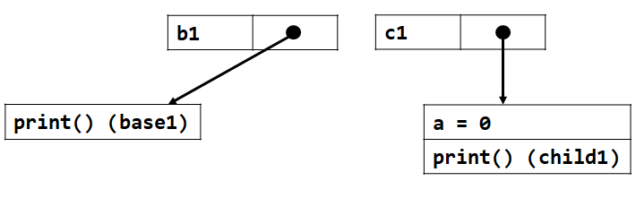

# Лабораторная работа 3 "SystemVerilog: ООП."

- [Лабораторная работа 3 "SystemVerilog: ООП."](#лабораторная-работа-3-systemverilog-ооп)
  - [Цель](#цель)
  - [Ход работы](#ход-работы)
  - [Основные обозначения](#основные-обозначения)
  - [Вступление](#вступление)
    - [Transaction-based verification (TBV)](#transaction-based-verification-tbv)
    - [Концепция ООП](#концепция-ооп)
    - [ООП в SystemVerilog](#ооп-в-systemverilog)
  - [Теория](#теория)
    - [1. Необходимые конструкции SystemVerilog](#1-необходимые-конструкции-systemverilog)
      - [1.1. Системная функция `$cast`](#11-системная-функция-cast)
      - [1.2. Виртуальный интефейс](#12-виртуальный-интефейс)
    - [2. SystemVerilog классы](#2-systemverilog-классы)
      - [2.1. Определение](#21-определение)
      - [2.2. Object handle](#22-object-handle)
      - [2.3. Объект класса](#23-объект-класса)
      - [2.4. Уничтожение объектов класса](#24-уничтожение-объектов-класса)
    - [3. SystemVerilog и наследование классов](#3-systemverilog-и-наследование-классов)
      - [3.1. Ключевое слово `super`](#31-ключевое-слово-super)
    - [4. SystemVerilog ключевое слово `this`](#4-systemverilog-ключевое-слово-this)
    - [5. SystemVerilog статические и автоматические элементы классов](#5-systemverilog-статические-и-автоматические-элементы-классов)
      - [5.1. Автоматические элементы](#51-автоматические-элементы)
      - [5.2. Статические элементы](#52-статические-элементы)
      - [5.2.1. Статические поля](#521-статические-поля)
      - [5.2.2. Статические методы](#522-статические-методы)
        - [5.2.2.1.\* Отличие статических методов класса от статических функций (`static function` vs `function static`)\*](#5221-отличие-статических-методов-класса-от-статических-функций-static-function-vs-function-static)
      - [5.2.3 Статические поля и методы](#523-статические-поля-и-методы)
    - [6. SystemVerilog виртуальные методы классов](#6-systemverilog-виртуальные-методы-классов)
      - [6.1. Типы автоматическиих методов классов](#61-типы-автоматическиих-методов-классов)
        - [6.1.1. Виртуальные методы](#611-виртуальные-методы)
        - [6.1.2. Невиртуальные методы](#612-невиртуальные-методы)
    - [7. Systemverilog классы и приведение типов](#7-systemverilog-классы-и-приведение-типов)
      - [7.1. Upcasting](#71-upcasting)
      - [7.2. Downcasting](#72-downcasting)
    - [8. SystemVerilog и полиморфизм](#8-systemverilog-и-полиморфизм)
    - [9. SystemVerilog и виртуальные классы](#9-systemverilog-и-виртуальные-классы)
    - [10. SystemVerilog и pure virtual методы](#10-systemverilog-и-pure-virtual-методы)
    - [11. SystemVerilog и модификаторы доступа элементов класса](#11-systemverilog-и-модификаторы-доступа-элементов-класса)
      - [11.1. Локальные (`local`) элементы класса](#111-локальные-local-элементы-класса)
      - [11.2. Защищенные (`protected`) элементы класса](#112-защищенные-protected-элементы-класса)
    - [12. Структурная схема верификационного окружения с применением ООП.](#12-структурная-схема-верификационного-окружения-с-применением-ооп)
  - [Список ссылок](#список-ссылок)

## Цель

---

## Ход работы

---

## Основные обозначения

|Так выделяется важная информация, на которой стоит заострить внимание|
|:---|

_Так выделяется разбор примеров._

`Так выделяются определения, и ключевые слова SystemVerilog.`


## Вступление

В современных реалиях верификация цифрового устройства может занимать до 80% времени его разработки<sup>[1]</sup>. Временные затраты на верификацию растут в геометрической прогрессии со сложностью дизайна и его техническим процессом<sup>[1]</sup>.

Современные языки описания аппаратуры, к сожалению, не могут предоставить предельно высокого уровня абстракции для написания тестовых сценариев. В связи с этим все большую популярность набирает подход к написанию окружения при помощи библиотек сторонних языков программирования (привет, [cocotb](https://www.cocotb.org/)!). Стоит отметить, что данный подход только "набирает обороты", и пройдет еще много времени до того момента, как он станет индустриальным стандартом (если вообще станет).

Так какой же подход используется в индустрии в настоящее время? И существуют ли возможности упрощения жизни современному верификатору? Какой подход использовать, если нужно проверить, например, СнК, состояющую из множества модулей, которые, к тому же, нужно еще проверить по отдельности? Ответ: да, существуют. И начало этому положила верификация, основанная на транзакциях (transaction-based verification).

### Transaction-based verification (TBV)

В определенный период развития индустрии проектирования и верификации цифровых устройств был предложен подход, добавляющий некоторый уровень абстракции при написании тестового окружения и тестовых сценариев для проверки дизайнов. Такой подход назвали `верификацией, основанной на транзакциях` или `transaction-based verification`.

Суть подхода заключалась в том, чтобы окружение состояло из некоторых компонентов, обменивающихся между собой порциями данных (транзакциями), содержащими всю необходимую информацию для тестирования. А в определенный момент времени транзакция конвертировалась в набор сигналов, впоследствии выставляемых на порты устройства.

_На изображении ниже представлена общая концепция подхода. Компонент `Generator` создает транзакции и пересылает их компоненту `Converter` (иначе `Driver`), который конвертирует транзакции в сигналы на портах тестируемого устройства._


|Открытым `остается вопрос`: каким образом реализовывать TBV подход?|
|:---|

### Концепция ООП

|`Методология` программирования, основанная на представлении программы в виде `совокупности взаимодействующих объектов`, каждый из которых является экземпляром определённого класса, а классы образуют иерархию наследования.|
|:---|

Кажется, что данную методологию как нельзя лучше можно применить в рамках TBV. Остается открытым еще один вопрос: есть ли в языке SystemVerilog функционал, при помощи которого эта методолгия реплизуема. И ответом будет: есть.

### ООП в SystemVerilog

`В SystemVerilog реализуется большинство концепций ООП`: классы, наследование, полиморфизм и так далее. Все это позволяет создавать гибкие и параметризуемые тестовые окружения для сложносоставных дизайнов, интегрировать блоки для проверки конкретных модулей в тестовое окружение большой системы.


## Теория

### 1. Необходимые конструкции SystemVerilog

#### 1.1. Системная функция `$cast`

|Системная функция `$cast()` используется для приведения типов переменных, типы которых не обязательно могут быть совместимыми.|
|:---|

`$cast() используется динамически` в течение хода симуляции.

Функция `$cast() возвращает 1, если приведение типов произошло успешно`, иначе возвращает 0.

_Синтаксис._

```verilog
$cast(<целевая переменная>, <выражение источник>);
```

_Пример._

```verilog
// 'Colors' type enumerate
typedef enum { red = 0, green = 1, blue = 2, yellow = 3} Colors;
Colors col;

initial begin
    if ( ! $cast( col, 2 + 8 ) ) // Invalid cast: 10 not inside {0, 1, 2, 3}
    $display( "Error in cast!" );
end
```

_В данном примере просходит приведение типа `int` к типу `Colors`, однако `$cast()` вернет 0, так как среди возможных значений типа `Colors` нет 10._

#### 1.2. Виртуальный интефейс

В SystemVerilog `виртуальный интерфейс является указателем на физический интерфейс` и позволяет динамическим объектам взаимодействовать со статическими портами дизайна.

Виртуальный интерфейс объявляется при помощи ключевого слова `virtual`.

_Пример._


```verilog
module testbench;
    ...
    inv_if intf(clk);

    virtual inv_if vintf = intf;

    test t;

    initial begin
        t = new(vintf);
        t.run();
    end

endmodule
```

_В данном примере виртуальный интерфейс `vintf` начинает указывать на физический `intf` при помощи обычного процедурного присваивания `=` Далее виртуальный интерфейс в качестве аргумента передается в конструктор класса теста (тестового сценария). Подробнее про типичные блоки окружения написано в [пункте 12](#12-структурная-схема-верификационного-окружения-с-применением-ооп))._


### 2. SystemVerilog классы

#### 2.1. Определение

|`Класс` — динамический тип, который включает `переменные различных типов (поля)`, а также `задачи и функции SystemVerilog (методы)`, которые предназначены для взаимодействия с полями.|
|:---|

_Синтаксис._

```verilog
<модификаторы> class <имя>;
    <тело>
endclass 
```

_Пример._

```verilog
class base1;

    bit [7:0] a;

    virtual function void set_show (bit [7:0] i1);
        a = i1;
        $display("base1 : a = %2h", i1);
    endfunction

endclass 
```

_В данном примере описан класс типа `base1`, содержащий поле `a` и метод `set_show()`._

#### 2.2. Object handle

|`Object handle` — это «безопасный» указатель на объект. Может быть объявлен без фактического создания объекта. Служит для размещения указателя на объект класса, находящийся в памяти.|
|:---|

_Пример._


```verilog
class base1;

    bit [7:0] a;

    virtual function void set_show (bit [7:0] i1);
        a = i1;
        $display("base1 : a = %2h", i1);
    endfunction

endclass

base1 b1; // Handle
```

_К предыдущему примеру добавлен пустой (ни на что не указывающий) object handle типа `base1` с именем `b`._

`Object handle нельзя манипулировать математически`. То есть, если, например, в языке C можно прибавить к указателю числа, то он будет указывать уже на другое место в памяти. В SystemVerilog такая операция невозможна.

_Пример._

```c
int main() {

  ...  

  int* ptr;

  printf("*ptr = %d \n", *(ptr+1)); // In SystemVerilog you can’t do like this 

  return 0;
}
```

#### 2.3. Объект класса

|`Объект класса` является `одной из его реализаций в памяти`.|
|:---|

Функция `new()` создает объект класса.

_Пример._


```verilog
class base1;

    bit [7:0] a;

    virtual function void set_show (bit [7:0] i1);
        a = i1;
        $display("base1 : a = %2h", i1);
    endfunction

endclass 

base1 b1;
initial b1 = new(); // Create class object and assign handle 'b1' to it
```

_В примере выше после вызова `new` object handle `b1` указывает на конкретный объект класса типа `base1` в памяти._

|Класс – динамический тип, так что `объекты могут создаваться в течение времени симуляции`.|
|:---|

#### 2.4. Уничтожение объектов класса

|`Объекты SystemVerilog не могут быть уничтожены явным образом`. Можно «уничтожить» объект, заново инициализировав handle через `new()`, либо явно определив его значение как `null`.|
|:---|

_Пример._


```verilog
class base1;
    ...
endclass 

base1 b1;
initial begin
    b1 = new();
    b1.a = 5;
    b1 = new();
    b1.a = 10;
end
```

_В данном примере изначально был создан объект класса, и указатель был помещен в `b1`. Потом `b1` был инициализирован новым объектом, а старый будет автоматически уничтожен симулятором._

_Пример._

```verilog
class base1;
    ...
endclass 

base1 b1;
initial begin
    b1 = new();
    b1.a = 5;
    b1 = null;
end
```

_В данном примере изначально был создан объект класса, и указатель был помещен в `b1`. После чего handle `b1` было присвоено значение `null`, а объект класса будет автоматически уничтожен после этого присваивания._


### 3. SystemVerilog и наследование классов

|В SystemVerilog для наследования классов используется ключевое слово `extends`. Объект наследуемого класса имеет доступ к полям и методам объекта родительского, если они не защищены модификаторами доступа.|
|:---|

_Пример._


```verilog
class base1;
    int a;   
endclass

class child1 extends base1;
    function void print();
        $display(a);
    endfunction
endclass

initial begin
    child1 c1 = new();
    c1.print(); // Will print 0
end
```

_В данном примере класс типа `child1` наследуется от класса типа `base1`. Поле `a` будет доступно для использования всем объектам типа `base1` и `child1`. А вот метод `print()` только объектам типа `child1`._

#### 3.1. Ключевое слово `super`

|`super` используется для доступа к методам или полям базового класса (того, от которого наследован текущий).|
|:---|

_Пример._


```verilog
class base1;
    function void print_base();
        $display(“Hello base1”);
    endfunction
endclass

class child1 extends base1;
    function void print_child();
        super.print_base();
        $display(“Hello child1”);
    endfunction
endclass

initial begin
    child1 c1 = new();
    c1.print(); // Will print “Hello base1” and
end             //            “Hello child1”
```

_В данном примере класс типа `child1` наследуется от класса типа `base1`. В методе `print_child` вызывается метод родительского класса через ключевое слово `super`._

Стоит отметить, что обращение к элементам родительского класса через `super` не может быть "вложенным", то есть в обращении может фигурировать только одно `super`. Например, конструкция `super.super.print()` не поддерживается в SystemVerilog.


### 4. SystemVerilog ключевое слово `this`

|`this` относится к текущему определению класса и используется для устранения двусмысленности при доступе к полям и методам.|
|:---|

_Пример._


```verilog
class base1;

    int a;

    function void set_good(int a);
        this.a = a;
    endfunction

    function void set_bad(int a);
        a = a; // Class field will not be updated!
    endfunction

endclass
```

_В данном примере название поля аргумента совпадает с названием аргумента функций, так что необходимо использовать `this`, иначе значение поля не будет обновлено._


### 5. SystemVerilog статические и автоматические элементы классов

#### 5.1. Автоматические элементы

|В SystemVerilog элементы классов `по умолчанию автоматические`. То есть, для каждого объекта класса выделяется своя память под поля, методы и переменные методов. Каждый объект классов имеет свои копии переменных. Методы каждого объекта ведут себя как автоматические функции.|
|:---|

```verilog
class base1;

    /*automatic*/ bit a; // Implicitly automatic here
    function /*automatic*/ void print(); // Implicitly automatic here
        $display(“Hello base1”);
    endfunction

endclass
```

#### 5.2. Статические элементы

|В SystemVerilog элементы классов можно объявить статическими при помощи ключевого слова `static`. Такие элементы являются общими для всех объектов класса конкретного типа.|
|:---|

|К статическим элементам класса нужно обращаться через оператор `::`|
|:---|

```verilog
class base1;
    static int a;
endclass

initial base1::a = 1;
```

#### 5.2.1. Статические поля

|Статическое поле класса можно объявить при помощи `static`. Тогда `поле станет общим для всех объектов класса конкретного типа`. Изменение поля в любом из объектов изменит его значение во всех объектах (существующих и еще не созданных). Можно сказать, что такое поле принадлежит типу, а не объекту класса.|
|:---|

_Пример._

```verilog
class base1;
    static int a;
    function void print();
        $display(a);
    endfunction
endclass

base1 b1, b2;
initial begin
    base1::a = 1;
    b1 = new();
    b1.print(); // Will print '1', because 'a' was set via ::
    b2 = new();
    b2.a = 2;
    b2.print(); // Will print '2', because 'a' was set via object handle
    b2.print(); // Will also print '2', because 'a' belongs to the type
end
```

_В данном примере значение поля `a` меняется через `::`, далее через object handle, создержащий указатель на один из объектов типа `base1`. Во всех случаях изменение поля `a` отражается на всех объектах типа `base1`, даже на несозданных._

Значение `статических переменных` можно изменять через созданные объекты конкретного типа, однако `настоятельно рекомендуется изменять их только при помощи оператора ::` конкретного типа.

#### 5.2.2. Статические методы

В SystemVerilog статические методы классов имеют иное значение, нежели классические статические методы. Более того, `классический статический метод не может быть объявлен в классе`. Подробнее в [пункте 5.2.2.1](#5221-отличие-статических-методов-класса-от-статических-static-function-vs-function-static)).

```verilog
class base1;
    function static print(); // Illegal
        $display("Hello base1");
    endfunction
endclass
```

|Статический метод класса объявляется при помощи `static`, написанным до `function`/`task`. Тогда `метод станет общим для всех объектов класса конкретного типа`. Можно сказать, что метод принадлежит типу, а не объекту класса.|
|:---|

```verilog
class base1;
    static function print();
        $display("Hello base1");
    endfunction
endclass

initial base1::print(); // Will print 'Hello base1'
```

Можно вызывать `статические методы` через созданные объекты конкретного типа, однако настоятельно `рекомендуется вызывать их только при помощи оператора ::` конкретного типа.

|`Статические методы` классов `не могут` быть `виртуальными`.|
|:---|

##### 5.2.2.1.* Отличие статических методов класса от статических функций (`static function` vs `function static`)*

Основное отличие статических методов класса (`static function`) от классических (`function static`) в том, что `static в случае методов класса не дает функции статическое поведение`, а делает метод общим для всех объектов класса конкретного типа.

_Пример._

```verilog
class base1;
    ...
    // In this function variable 'c' is automatic
    // Because this is class 'static function', not
    // default 'function static'
    static function void static_class_func(bit incr);
        int c;
        if(incr) c = c + 1;
        $display("class_func: c = %0d", c);
    endfunction
endclass

// In this function variable 'c' is static
// Because this is default 'function static'
// class 'static function'
function static static_base_func(bit incr);
    int c;
    if(incr) c = c + 1;
    $display("base_func: c = %0d", c);
endfunction

initial begin
    base1::static_class_func(1); // c = 1
    base1::static_class_func(1); // c = 1
    static_base_func(1);         // c = 1
    static_base_func(1);         // c = 2
end
```

_Результат._

```
# Loading work.static_example_1(fast)
# run -a
# class_func: c = 1
# class_func: c = 1
# base_func: c = 1
# base_func: c = 2
```

_В данном примере переменная `c` функции `base1::static_class_func` не является статической и не сохраняет свое значение между вызовами. В отличии от переменной `c` функции `static_base_func`._

#### 5.2.3 Статические поля и методы

|Статические методы класса могут взаимодействовать только со статическими полями класса и наоборот.|
|:---|

_Пример._

```verilog
class base1;

    static int b;
    static int a = get_a();
    
    static function int get_a();
        return 5;
    endfunction

    static function void set_b(int _b);
        b = _b;
    endfunction

    static function void print();
        $display("a = %0d b = %0d", a, b);
    endfunction

endclass

initial begin
    base1::set_b(10);
    base1::print();
end
```

_Результат._

```
# Loading work.static_example_1(fast)
# run -a
# a = 5 b = 10
```


### 6. SystemVerilog виртуальные методы классов

#### 6.1. Типы автоматическиих методов классов

В SystemVerilog, `не статический метод может быть`:
  - виртуальным;
  - не виртуальным.

##### 6.1.1. Виртуальные методы

`Виртуальный` метод объявляется при помощи ключевого слова `virtual`.

_Пример._

```verilog
class base1;
    virtual function void print();
        $display(“Hello base1”);
    endfunction
endclass
```

|`Виртуальный` метод в наследуемом классе должен иметь такое же количество аргументов с такими же типами и направлениями, а также такой же тип возвращаемого значения.|
|:---|

_Пример._

```verilog
class base1;
    virtual function void print();
        $display(“Hello base1”);
    endfunction
endclass

class сhild1 extends base1;
    virtual function void print();
        $display(“Hello child1”);
    endfunction
endclass
```

|Если в родительском классе метод объявлен виртуальным, то во всех наследуемых классах он также является виртуальным, даже если объявлен без ключевого слова `virtual`.|
|:---|

_Пример._

```verilog
class base1;
    virtual function void print();
        $display(“Hello base1”);
    endfunction
endclass

class сhild1 extends base1;
    function void print(); // Implicitly virtual because base1.print() is virtual
        $display(“Hello child1”);
    endfunction
endclass
```

_В данном примере метод `print()` в классе типа `child1` является виртуальным, так как в классе типа, от которого он наследуется, этот метод является виртуальным._

`Виртуальные методы` в SystemVerilog `обладают свойством`, через которое реализуется `полимофризм`. Более подробно это будет рассмотрено в [пункте 8](#8-systemverilog-и-полиморфизм).

##### 6.1.2. Невиртуальные методы

|Если метод не объявлен виртуальным или не является методом наследника от базового класса, где он был объявлен виртуальным, то это `невиртуальный метод`.|
|:---|

|Не виртуальный метод может переопределяться в наследуемых классах без каких-либо ограничений.|
|:---|

_Пример._

```verilog
class base1;
    function void print();
        $display(“Hello base1”);
    endfunction
endclass

class сhild1 extends base1;
    function bit print(bit a);
        $display(a);
        return a;
    endfunction
endclass
```

_В данном примере наследуемый метод имеет иной тип возвращаемого значения, иное количество аргументов и иной тип аргументов._


### 7. Systemverilog классы и приведение типов

|Приведение типов происходит при смене объекта, на который указывает object handle.|
|:---|

#### 7.1. Upcasting

|`Upcasting` - присвоение object handle базового класса object handle наследованного. `Upcasting` может быть выполнен всегда.|
|:---|

_Пример._



```verilog
class base1;
    ...
endclass

class сhild1 extends base1;
    int a;
    function void print();
        $display(“Hello child1”);
    endfunction
endclass

base1 b1;
child1 c1;
initial begin
    b1 = new();
    c1 = new();
end
```

_Есть два object handle. `b1` указывает на родительсктй объект, `c1` на отнаследованный._

_Далее присвоим `b1 = c1`. Теперь object handle базового типа указывает на объект наследованного типа._


```verilog
class base1;
    ...
endclass

class сhild1 extends base1;
    int a;
    function void print();
        $display(“Hello child1”);
    endfunction
endclass

base1 b1;
child1 c1;
initial begin
    b1 = new();
    c1 = new();
    b1 = c1;
end
```

_В данном случае, то, к каким полям мы можем обращаться, зависит от того, через какой object handle мы это делаем. Обращение `b1.a` не может быть выполнено, так как это object handle базового класса, однако `c1.a` может быть выполнено._

#### 7.2. Downcasting

|`Downcasting` - присвоение object handle наследованного класса object handle родительского. `Downcasting` может быть выполнен если родительский handle указывает на объект целевого типа, или же типа, наследованного от целевого.|
|:---|

`Downcasting` требует run-time проверки. Для этого применяется системная функция `$cast()`.

_Пример._


```verilog
class base1;
    ...
endclass

class сhild1 extends base1;
    int a;
    function void print();
        $display(“Hello child1”);
    endfunction
endclass

base1 b1;
child1 c1, c2;
initial begin
    b1 = new();
    c1 = new();
end
```

_Есть три object handle. `b1` указывает на родительсктй объект, `c1` на отнаследованный. `c2` пока пустой._

_Далее присвоим `b1 = c1`. Теперь object handle базового типа указывает на объект наследованного типа._

_Далее присвоим `c2 = c1` через `$cast(c2, c1)`. Теперь object handle наследованного типа указывает на объект этого же наследованного типа._


```verilog
class base1;
    ...
endclass

class сhild1 extends base1;
    int a;
    function void print();
        $display(“Hello child1”);
    endfunction
endclass

base1 b1;
child1 c1, c2;
initial begin
    b1 = new();
    c1 = new();
    b1 = c1;
    $cast(c2, b1);
end
```

_Отметим, что теперь легальны оба обращения: `c1.a` и `c2.a`._


### 8. SystemVerilog и полиморфизм

`Полиморфизм` – это концепция, позволяющая объекту или методу принимать другое значение в зависимости от контекста, в котором он используется.

|Полиморфизм в SystemVerilog реализуется `через виртуальные методы классов`.|
|:---|

|`Основное свойство виртуальных методов SystemVerilog`: Если object handle базового типа указывает на объект наследованного типа, и метод в базовом типе является виртуальным, то при вызове этого метода через object handle базового типа, будет использована реализация этого метода наследованного типа.|
|:---|

_Пример._

_В данном примере при вызове `b1.print()` будет использована реализация типа `base1`, то есть вывод `"Hello base1"`, так как метод не является виртуальным в базовом типе._

```verilog
class base1;
    function void print();
        $display(“Hello base1”);
    endfunction
endclass

class сhild1 extends base1;
    int a;
    function void print();
        $display(“Hello child1”);
    endfunction
endclass

base1 b1;
child1 c1;
initial begin
    b1 = new();
    c1 = new();
    b1 = c1;
    b1.print(); // Will print "Hello base1"
end
```

_А в примере ниже при вызове `b1.print()` будет использована реализация типа `child1`, то есть вывод `"Hello child1"`, так как метод является виртуальным в базовом типе._

```verilog
class base1;
    virtual function void print();
        $display(“Hello base1”);
    endfunction
endclass

class сhild1 extends base1;
    int a;
    function void print();
        $display(“Hello child1”);
    endfunction
endclass

base1 b1;
child1 c1;
initial begin
    b1 = new();
    c1 = new();
    b1 = c1;
    b1.print(); // Will print "Hello child1"
end
```

### 9. SystemVerilog и виртуальные классы

|`Виртуальный класс` – класс, объект типа которого не может быть создан.|
|:---|

`Виртуальный` класс объявляется при помощи ключевого слова `virtual`.

`Виртуальный класс предназначен для создания "шаблона" для классов, являющихся его потомками`. Зачастую различные объекты классов-потомков виртуального класса создаются и помещаются в object handle базового класса для выполнения своих определенных в виртуальном классе методов.

_Пример._

```verilog
virtual class base1;
    virtual function void print();
        $display(“Hello base1”);
    endfunction
endclass

base1 b1;
initial begin
    b1 = new(); // Illegal
end
```

_В данном примере комилятор выдаст ошибку из-за невозможности создать объект типа `base1`, так как класс этого типа является виртуальным._

_А в примере ниже создается объект типа `child1` и после этого, через `b1 = c1`, указатель на него помещается в handle базового виртуального класса. Через `b1.print()` вызывается реализация `print()` наследованного типа, так как метод является виртуальным._

```verilog
virtual class base1;
    virtual function void print();
        $display(“Hello base1”);
    endfunction
endclass

class сhild1 extends base1;
    function void print();
        $display(“Hello child1”);
    endfunction
endclass

base1 b1;
child1 c1;
initial begin
    с1 = new();
    b1 = c1;
    b1.print();
end
```

Стоит отметить, что в `виртуальном классе методы по умолчанию не являются виртуальными` и точно также должны быть объявлены таковыми при помощи ключевого слова `virtual`.

### 10. SystemVerilog и pure virtual методы

|Виртуальный метод (и только виртуальный) может быть объявлен как `pure virtual`, то есть "чистый виртуальный метод".|
|:---|

У `pure virtual` методов есть `следующие особенности`:
  - их определение возможно только в виртуальных классах;
  - такой метод не должен иметь реализации в виртуальном классе;
  - такой метод должен быть переопределен во всех ближайщих наследниках класса, в котором он определен.

Также на `pure virtual` методы распространяются все ограничения виртуальных методов (см. [пункт 6.1.1](#611-виртуальные-методы)).


### 11. SystemVerilog и модификаторы доступа элементов класса

В SystemVerilog существует два модификатора доступа к элементам класса:
  - `local`;
  - `protected`.

#### 11.1. Локальные (`local`) элементы класса

|Если элемент определен как `local`, то к нему имеют доступ только объекты типа класса, в котором он определен.|
|:---|

_Пример._

```verilog
class base1;

    local bit a;

    function void set_a(bit a);
        this.a = a;
    endfunction

    function void print_a();
        $display(a);
    endfunction

endclass

base1 b1;
initial begin
    b1 = new();
    $display(b1.a); // Illegal because 'local' field
    b1.set_a(1);    // Legal to change 'a' via class method
    b1.print_a();   // Legal to зкште 'a' via class method
end
```

_В данном примере пользователь не может обратиться к локальному полю объекта через `b1.a`, так как `a` в определении класса типа `base1` объявлен как `local`._

#### 11.2. Защищенные (`protected`) элементы класса

|Если элемент определен как `protected`, то к нему имеют доступ объекты типа класса, в котором он определен, и объекты типов его потомков.|
|:---|

_Пример._

```verilog
class base1;

    bit a;

    function void set_a(bit a);
        this.a = a;
    endfunction

    protected function void print_a();
        $display(a);
    endfunction

endclass

class child1 extends base1;

    function void print_a();
        super.print_a(); // Can call parent method as it is 'protected'
    endfunction

endclass


child1 c1; bit a;
initial begin
    c1 = new();
    a = c1.print_a();
end
```

_В данном примере тип `child1` наследуется от `base1`, в котором метод `print_a()` объявлен как `protected`. Поэтому в переопределенном методе `print_a()` в классе типа `child1` можно обращаться к базовой реализации через `super`._


### 12. Структурная схема верификационного окружения с применением ООП.

Типичная ("классическая") стуктурная схема верификационного окружения с применением ООП представлена на рисунке ниже.


Окружение `состоит из:`
  - `Test`: класса теста (тестового сценария);
  - `Environment`: класса окружения, своего рода контейнера из компонентов, взаимодействующих с дизайном и оценивающих его поведение;
  - `Generator`: класс генератора входных воздействий;
  - `Driver`: класс, получающий транзакции от генератора и модулирующий из них сигналы на порты дизайна;
  - `Monitor`: класс, оценивающий состояние портов дизайна и генерирующий информационные транзакции;
  - `Scoreboard`: класс, получающий информацию от других компонентов (как правило, `Monitor`) и оценивающий корректность работы дизайна;
  - `Config`: множества классов конфигурации, как теста, так и других компонентов;
  - Множества классов транзакций, передающихся между компонентами окружения (на схеме не именованы).

Транзакции передаются между компонентами при помощи `mailbox`.

_Пример_.


_В данном примере для передачи информации между компонентами используется класс `transaction`. В компонентах определены `mailbox`, через которые будут передаваться транзакции. Также в компонентах определен `виртуальный интерфейс`, через который окружение может получать информацию о состоянии дизайна, а также генерировать входные воздействия._

_В классе окружения `env` создаются `mailbox` и "указатель" на них передается в классы, которые нужно соединить для передачи данных . Например._

```verilog
class env;

    ...

    generator  gen;
    driver     drv;

    ...

    mailbox #(transaction) gen2drv_mbx;

    ...

    virtual function void connect_comp();
        gen2drv_mbx = new();
        ...
        gen.mbx = gen2drv_mbx;
        drv.mbx = gen2drv_mbx;
        ...
    endfunction

```

_В данном примере для классов `generator` и `driver` создается общий `mailbox`. А поля `mbx` в `generator` и `driver` после вызова `connect_comp` будут указывать на эту `mailbox`_.

## Список ссылок

| № | Описание                                                                                  |
|---|-------------------------------------------------------------------------------------------|
|1. | Pre-Silicon Verification Using Multi-FPGA Platforms: A Review, Umer Farooq &  Habib Mehrez |
